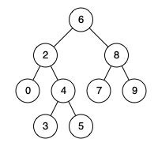

# 235. Lowest Common Ancestor of a Binary Search Tree <Badge type="warning" text="Medium" />

Given a binary search tree (BST), find the lowest common ancestor (LCA) node of two given nodes in the BST.

According to the definition of LCA on Wikipedia: "The lowest common ancestor is defined between two nodes `p` and `q` as the lowest node in T that has both `p` and `q` as descendants (where we allow a node to be a descendant of itself)."

For example, given the following binary search tree:  `root = [6,2,8,0,4,7,9,null,null,3,5]`



> Example 1:   
Input: root = [6,2,8,0,4,7,9,null,null,3,5], p = 2, q = 8  
Output: 6   
Explanation: The LCA of nodes 2 and 8 is 6.

> Example 2:   
Input: root = [6,2,8,0,4,7,9,null,null,3,5], p = 2, q = 4  
Output: 2  
Explanation: The LCA of nodes 2 and 4 is 2, since a node can be a descendant of itself according to the LCA definition.

## Approach

**Input:** The root node of a Binary Search Tree (BST) `root`, and two specified nodes `p` and `q`.

**Output:** Return the lowest common ancestor of these two nodes.

This problem is suitable to be solved using the **properties of Binary Search Tree (BST)** combined with **Bottom-up DFS**. Due to it being a BST, the node values satisfy the property `Left Subtree < Current Node < Right Subtree`, which allows us to efficiently locate `p` and `q`.

We can summarize the following 3 cases:
1. If the values of `p` and `q` are on opposite sides of the current node's value (one smaller, one larger), then the current node is the lowest common ancestor.
2. If both `p` and `q`'s values are smaller than the current node's value, it means they are both in the left subtree. We recurse into the left subtree to continue searching.
3. If both `p` and `q`'s values are larger than the current node's value, it means they are both in the right subtree. We recurse into the right subtree to continue searching.

Therefore, by comparing the current node's value with the values of `p` and `q`, we can quickly determine the search direction utilizing the BST property, and recurse or directly return the lowest common ancestor.

**Key points**:
- The ordered nature of the BST allows us to avoid a full traversal of the tree, determining the search direction simply by comparing node values.
- When the lowest common ancestor is found, it could be `p` or `q` themselves (if one is an ancestor of the other), or some intermediate node (`p` and `q` are split into left and right subtrees).

```
Case Breakdown
│
├── Current node is smaller than both q and p
│   └── The answer is in the right subtree
│
├── Current node is larger than both p and q
│   └── The answer is in the left subtree
│
├── Current node is larger than p, smaller than q
│   └── The current node is the answer
│
└── 
```

## Implementation

::: code-group

```python
class Solution:
    def lowestCommonAncestor(self, root: 'TreeNode', p: 'TreeNode', q: 'TreeNode') -> 'TreeNode':
        # Get the current node's value
        x = root.val

        # If both p and q's values are smaller than the current node's value, they are both in the left subtree
        # Recurse to the left subtree to continue searching
        if p.val < x and q.val < x:
            return self.lowestCommonAncestor(root.left, p, q)

        # If both p and q's values are larger than the current node's value, they are both in the right subtree
        # Recurse to the right subtree to continue searching
        if p.val > x and q.val > x:
            return self.lowestCommonAncestor(root.right, p, q)
        
        # If one node is in the left subtree and the other in the right, or the current node is either p or q
        # Then the current node is the lowest common ancestor
        return root
```

```javascript
/**
 * @param {TreeNode} root
 * @param {TreeNode} p
 * @param {TreeNode} q
 * @return {TreeNode}
 */
var lowestCommonAncestor = function(root, p, q) {
    const x = root.val;

    if (p.val < x && q.val < x) 
        return lowestCommonAncestor(root.left, p, q);

    if (p.val > x && q.val > x)
        return lowestCommonAncestor(root.right, p, q);
    
    return root;
};
```

:::

## Complexity Analysis

- Time Complexity: `O(n)`
- Space Complexity: `O(h)`

## Links

[235. Lowest Common Ancestor of a Binary Search Tree (English)](https://leetcode.com/problems/lowest-common-ancestor-of-a-binary-search-tree/description/)

[235. 二叉搜索树的最近公共祖先 (Chinese)](https://leetcode.cn/problems/lowest-common-ancestor-of-a-binary-search-tree/description/)
