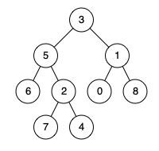

# 236. Lowest Common Ancestor of a Binary Tree <Badge type="warning" text="Medium" />

Given a binary tree, find the lowest common ancestor (LCA) of two given nodes in the tree.

According to the definition of LCA on Wikipedia: "The lowest common ancestor is defined between two nodes `p` and `q` as the lowest node in T that has both `p` and `q` as descendants (where we allow a node to be a descendant of itself)."

> Example 1:   
Input: root = [3,5,1,6,2,0,8,null,null,7,4], p = 5, q = 1  
Output: 3  
Explanation: The LCA of nodes 5 and 1 is 3.



> Example 2:  
Input: root = [3,5,1,6,2,0,8,null,null,7,4], p = 5, q = 4   
Output: 5   
Explanation: The LCA of nodes 5 and 4 is 5, since a node can be a descendant of itself according to the LCA definition.


> Example 3:  
Input: root = [1,2], p = 1, q = 2   
Output: 1

## Approach

**Input:** The root node of a binary tree `root`, and two specified nodes `p` and `q`

**Output:** Return the lowest common ancestor of these two nodes

This problem is suitable to be solved using **Bottom-up DFS**.

We can summarize the following 3 cases:
1. If `p` and `q` respectively lie in the left and right subtrees of the current node, then the current node is the lowest common ancestor.
2. If `p` and `q` both lie in the left subtree, then the lowest common ancestor is the node first found in the left subtree.
3. If `p` and `q` both lie in the right subtree, then the lowest common ancestor is the node first found in the right subtree.

Therefore, we traverse the nodes through DFS, looking for `p` or `q`. Once either node is found, we return it, and then determine the lowest common ancestor based on the return values from the left and right subtrees, passing it upwards.

```
Case Breakdown
│
├── Current node is empty
│   └── Return empty node (None)
│
├── Current node is p
│   └── Return current node (p)
│
├── Current node is q
│   └── Return current node (q)
│
└── Other cases (recurse left and right subtrees)
    │
    ├── Both left and right subtrees found something
    │   └── Return current node (the Lowest Common Ancestor)
    │
    ├── Only the left subtree found something
    │   └── Return left subtree's result
    │
    ├── Only the right subtree found something
    │   └── Return right subtree's result
    │
    └── Neither subtree found something
        └── Return empty node (None)
```

## Implementation

::: code-group

```python
class Solution:
    def lowestCommonAncestor(self, root: 'TreeNode', p: 'TreeNode', q: 'TreeNode') -> 'TreeNode':
        """
        Find the Lowest Common Ancestor (LCA) of two nodes in a binary tree
        Approach: Postorder traversal (Bottom-up), recursively process left and right subtrees first, then handle the current node
        """
        # If the current node is null, or if it is exactly p or q, immediately return the current node
        if root is None or root == p or root == q:
            return root
        
        # Look for the LCA of p and q in the left subtree
        left = self.lowestCommonAncestor(root.left, p, q)
        # Look for the LCA of p and q in the right subtree
        right = self.lowestCommonAncestor(root.right, p, q)

        # If both left and right subtrees found p or q, it means the current node is the LCA
        if left and right:
            return root
        
        # If found in the left subtree, return left subtree's result
        if left:
            return left
        
        # If found in the right subtree, return right subtree's result
        return right
```

```javascript
/**
 * @param {TreeNode} root
 * @param {TreeNode} p
 * @param {TreeNode} q
 * @return {TreeNode}
 */
var lowestCommonAncestor = function(root, p, q) {
    if (!root || root == p || root == q) return root;

    const left = lowestCommonAncestor(root.left, p, q);
    const right = lowestCommonAncestor(root.right, p, q);

    if (left && right) return root;

    if (left) return left;

    return right;
};
```

:::

## Complexity Analysis

- Time Complexity: `O(n)`
- Space Complexity: `O(h)`

## Links

[236. Lowest Common Ancestor of a Binary Tree (English)](https://leetcode.com/problems/lowest-common-ancestor-of-a-binary-tree/description/)

[236. 二叉树的最近公共祖先 (Chinese)](https://leetcode.cn/problems/lowest-common-ancestor-of-a-binary-tree/description/)
