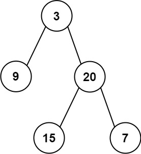

# 404. Sum of Left Leaves <Badge type="tip" text="Easy" />

Given the `root` of a binary tree, return *the sum of all left leaves*.

A **leaf** is a node with no children. A **left leaf** is a leaf that is the left child of another node.

> Example 1:   
Input: root = [3,9,20,null,null,15,7]   
Output: 24   
Explanation: There are two left leaves in the binary tree, with values 9 and 15 respectively.



> Example 2:  
Input: root = [1]  
Output: 0

## Approach

**Input:** The root node of a binary tree `root`

**Output:** Return the sum of all left leaves

This problem belongs to **Binary Tree Traversal** problems.

We can pass down an indicator of whether it's the left subtree during the traversal of the binary tree, and then determine if it's a leaf node.

If it meets both the condition of being a left subtree and a leaf node, we return the value of the current node; otherwise, return 0.

Finally, adding the sums from the left and right subtrees filters out the sum of the left leaves.

## Implementation

::: code-group

```python
class Solution:
    def sumOfLeftLeaves(self, root: Optional[TreeNode]) -> int:
        def dfs(node: Optional[TreeNode], is_left: bool) -> int:
            if node is None:
                return 0  # Return 0 directly for empty node
            
            # If it is a leaf node
            if not node.left and not node.right:
                return node.val if is_left else 0
            
            # Left subtree recursion (marked as a left child node)
            left_sum = dfs(node.left, True)
            # Right subtree recursion (marked as a right child node)
            right_sum = dfs(node.right, False)
            
            return left_sum + right_sum
        
        return dfs(root, False)
```

```javascript
/**
 * @param {TreeNode} root
 * @return {number}
 */
var sumOfLeftLeaves = function(root) {
    function dfs(node, isLeft) {
        if (!node) return 0;

        if (!node.left && !node.right)
            return isLeft ? node.val : 0;

        return dfs(node.left, true) + dfs(node.right, false);
    }

    return dfs(root, false);
};
```

:::

## Complexity Analysis

- Time Complexity: `O(n)`
- Space Complexity: `O(h)`

## Links

[404. Sum of Left Leaves (English)](https://leetcode.com/problems/sum-of-left-leaves/description/)

[404. 左叶子之和 (Chinese)](https://leetcode.cn/problems/sum-of-left-leaves/description/)
