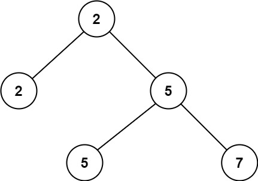
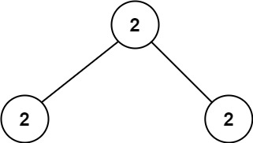

# 671. Second Minimum Node In a Binary Tree <Badge type="tip" text="Easy" />

Given a non-empty special binary tree consisting of nodes with the non-negative value, where each node in this tree has exactly `two` or `zero` sub-node. If the node has two sub-nodes, then this node's value is the smaller value among its two sub-nodes. More formally, the property `root.val = min(root.left.val, root.right.val)` always holds.

Given such a binary tree, you need to output the **second minimum** value in the set made of all the nodes' value in the whole tree.

If no such second minimum value exists, output -1 instead.

> Example 1:   
Input: root = [2,2,5,null,null,5,7]  
Output: 5  
Explanation: The smallest value is 2, the second smallest value is 5.



> Example 2:  
Input: root = [2,2,2]  
Output: -1  
Explanation: The smallest value is 2, but there isn't any second smallest value.



## Approach

**Input:** The root node of a binary tree `root`

**Output:** Return the second minimum value

This is a typical **Binary Tree Traversal** problem.

The problem has a specific property: each node has either zero or exactly two child nodes, and if it has two children, the current node's value is definitely the smaller of the two child nodes (which makes the root the minimum value for the entire tree).

Therefore, as long as this tree is not empty, the root node is definitely the minimum value.

We can use Depth-First Search (DFS) to traverse the entire tree:

* When we encounter a node with a value greater than the minimum value (i.e., the root node's value), it means it could be the second smallest value; at this point, we simply return this node's value (no need to traverse down to its child nodes).
* If the encountered node's value equals the minimum value, then continue to recursively traverse the left and right subtrees to look for a potential second minimum value.
* If the second minimum value cannot be found in either the left or the right subtree, then return `-1`.

Finally, by comparing the results returned by the left and right subtrees, we choose the smaller one as the second smallest value. If both return `-1`, it means there is no second smallest value in the entire tree.


## Implementation

::: code-group

```python
class Solution:
    def findSecondMinimumValue(self, root: Optional[TreeNode]) -> int:
        # If the root node is null, return -1
        if not root:
            return -1

        # Record the minimum value of the tree (root node value, because of the tree properties)
        smallest = root.val

        def dfs(node):
            # If the node is null, return -1
            if not node:
                return -1

            # If the current node value is greater than the minimum value, this could be the second minimum value
            if node.val > smallest:
                return node.val
            
            # Recursively traverse the left and right subtrees
            left = dfs(node.left)
            right = dfs(node.right)

            # If both subtrees return valid values, take the smaller one as the candidate
            if left != -1 and right != -1:
                return min(left, right)
            # If only one side has a valid value, return that value; otherwise return the other side's value
            else:
                return left if left != -1 else right
        
        # Return the second minimum value
        return dfs(root)
```

```javascript
/**
 * @param {TreeNode} root
 * @return {number}
 */
var findSecondMinimumValue = function(root) {
    if (!root) return -1;

    const smallest = root.val;

    function dfs(node) {
        if (!node) return -1;

        if (node.val > smallest) return node.val;

        const left = dfs(node.left);
        const right = dfs(node.right);

        if (left !== -1 && right !== -1) {
            return Math.min(left, right);
        }

        return left == -1 ? right : left;
    }

    return dfs(root);
};
```

:::

## Complexity Analysis

- Time Complexity: `O(n)`
- Space Complexity: `O(h)`

## Links

[671. Second Minimum Node In a Binary Tree (English)](https://leetcode.com/problems/second-minimum-node-in-a-binary-tree/)

[671. 二叉树中第二小的节点 (Chinese)](https://leetcode.cn/problems/second-minimum-node-in-a-binary-tree/)
