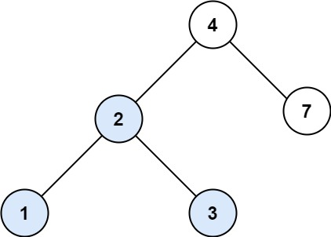
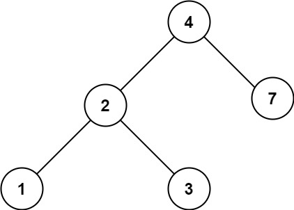

# 700. Search in a Binary Search Tree <Badge type="tip" text="Easy" />

You are given the `root` of a binary search tree (BST) and an integer `val`.

Find the node in the BST that the node's value equals `val` and return the subtree rooted with that node. If such a node does not exist, return `null`.

> Example 1:   
Input: root = [4,2,7,1,3], val = 2  
Output: [2,1,3]



> Example 2:  
Input: root = [4,2,7,1,3], val = 5  
Output: []



## Approach

**Input:** The root node of a binary search tree `root`, and an integer `val`

**Output:** Find the node with the value `val` and return it.

This problem is a **Binary Search Tree Traversal** problem.

According to the characteristics of a binary search tree, when the target value is smaller than the current node's value, it means the target node is in the left subtree, so we return the result of traversing the left subtree.

When the target value is larger than the current node's value, it means the target node is in the right subtree, so we return the result of traversing the right subtree.

We continue this process until we find a node with an equal value. If we reach an empty node and haven't found the target value, it means the node doesn't exist, and we directly return the empty node.

## Implementation

::: code-group

```python
class Solution:
    def searchBST(self, root: Optional[TreeNode], val: int) -> Optional[TreeNode]:
        # Search for a node with value 'val' in a Binary Search Tree (BST), and return the subtree rooted at that node
        def dfs(node, val):
            if not node:
                return None  # Reached an empty node, meaning not found

            if val < node.val:
                # The value to find is smaller than current node's value, search in the left subtree
                return dfs(node.left, val)
            elif val > node.val:
                # The value to find is larger than current node's value, search in the right subtree
                return dfs(node.right, val)
            else:
                # Found the node with value equal to 'val'
                return node

        return dfs(root, val)
```

```javascript
/*
 * @param {TreeNode} root
 * @param {number} val
 * @return {TreeNode}
 */
var searchBST = function(root, val) {
    function dfs(node, val) {
        if (!node) return node;

        if (val < node.val) 
            return dfs(node.left, val);
        
        if (val > node.val)
            return dfs(node.right, val)
        
        return node;
    }

    return dfs(root, val);
};
```

:::

## Complexity Analysis

- Time Complexity: `O(h)`
- Space Complexity: `O(h)`

## Links

[700. Search in a Binary Search Tree (English)](https://leetcode.com/problems/search-in-a-binary-search-tree/description/)

[700. 二叉搜索树中的搜索 (Chinese)](https://leetcode.cn/problems/search-in-a-binary-search-tree/description/)
