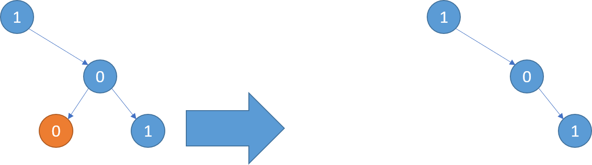
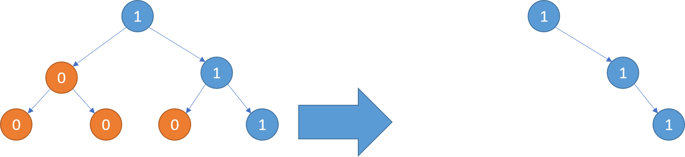
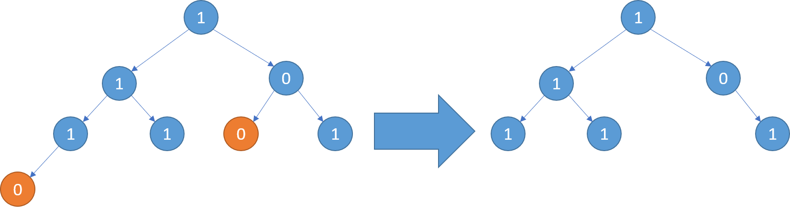

# 814. Binary Tree Pruning <Badge type="warning" text="Medium" />

Given the `root` of a binary tree, additionally, every node's value is either a `0` or a `1`.

Return the same tree where every subtree (of the given tree) not containing a `1` has been removed.

A subtree of a node `node` is `node` plus every node that is a descendant of `node`.

> Example 1:  
Input: root = [1,null,0,0,1] 
Output: [1,null,0,null,1] 
Explanation: Only the red nodes satisfy the property "every subtree not containing a 1". The diagram on the right represents the returned answer.



> Example 2:  
Input: root = [1,0,1,0,0,0,1]  
Output: [1,null,1,null,1]



> Example 3:  
Input: root = [1,1,0,1,1,0,1,0]  
Output: [1,1,0,1,1,null,1]



## Approach

**Input:** The root node of a binary tree `root`.

**Output:** Return the same binary tree after removing all subtrees not containing a `1`.

This problem belongs to **Bottom-up DFS + Pruning** problems.

We can break the problem down into 4 sub-problems:

1. If the current node doesn't exist, it means we should prune `return None`.
2. Recursively check if the current left node exists and contains 1. If it doesn't satisfy this, prune `return None`.
3. Recursively check if the current right node exists and contains 1. If it doesn't satisfy this, prune `return None`.
4. If both the left and right child nodes return `None`, we need to check if the current node's value is 1. If it isn't 1, we must also prune `return None`.

Therefore, the condition for pruning the current node is: **determine if the current node is 0 and neither of its child subtrees contain a 1.**

## Implementation

::: code-group

```python
class Solution:
    def pruneTree(self, root: Optional[TreeNode]) -> Optional[TreeNode]:
        def dfs(node):
            if not node:
                return None  # Empty node, prune directly
            
            # Recursively process left and right subtrees, returning the pruned subtrees
            node.left = dfs(node.left)
            node.right = dfs(node.right)
            
            # If the current node's value is 0 and both left and right subtrees are empty, it means the whole subtree has no 1, and should be pruned
            if node.val == 0 and not node.left and not node.right:
                return None
            
            # Otherwise, keep the current node
            return node
        
        return dfs(root)
```

```javascript
/*
 * @param {TreeNode} root
 * @return {TreeNode}
 */
var pruneTree = function(root) {
    function dfs(node) {
        if (!node) return null;

        node.left = dfs(node.left)
        node.right = dfs(node.right)

        if (node.val === 0 && !node.left && !node.right) 
            return null;
        
        return node;
    }

    return dfs(root);
};
```

:::

## Complexity Analysis

- Time Complexity: `O(n)`
- Space Complexity: `O(h)`, where `h` is the height of the tree

## Links

[814. Binary Tree Pruning (English)](https://leetcode.com/problems/binary-tree-pruning/description/)

[814. 二叉树剪枝 (Chinese)](https://leetcode.cn/problems/binary-tree-pruning/description/)
