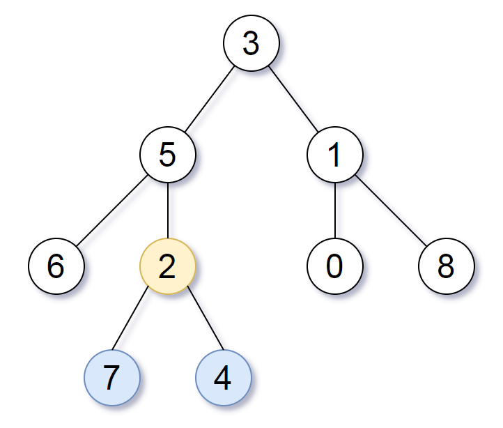

# 865. Smallest Subtree with all the Deepest Nodes <Badge type="warning" text="Medium" />

Given the `root` of a binary tree, the depth of each node is **the shortest distance to the root**.

Return *a node so that the subtree rooted at that node contains all the deepest nodes in the original tree*.

A node is called **the deepest** if it has the largest depth possible among any node in the entire tree.

The **subtree** of a node is that node, plus the set of all descendants of that node.

> Example 1:  
Input: root = [3,5,1,6,2,0,8,null,null,7,4]   
Output: [2,7,4]   
Explanation:   
We return the node with value 2, colored in yellow in the diagram.  
The nodes colored in blue are the deepest nodes of the tree.   
Notice that nodes 5, 3 and 2 contain the deepest nodes in the tree but node 2 is the smallest subtree among them, so we return it.



> Example 2:  
Input: root = [1]   
Output: [1]   
Explanation: The root is the deepest node in the tree.

> Example 3:  
Input: root = [0,1,3,null,2]   
Output: [2]   
Explanation: The deepest node in the tree is 2, the valid subtrees are the subtrees of nodes 2, 1 and 0 but the subtree of node 2 is the smallest.

## Approach

**Input:** The root node of a binary tree `root`.

**Output:** Return the lowest common ancestor that contains all the deepest nodes

This problem can be solved using either **Top-down DFS** or **Bottom-up DFS**.

### Top-down DFS

We can maintain two global variables `ans` and `max_depth` to record the answer and the maximum depth found.

* As we traverse downwards, we can pass the depth of the next level as an argument, and update the maximum depth at each step during the recursion.
* When evaluating whether the depths of the left and right subtrees are equal AND both reach the global maximum depth, that subtree's root is the answer.
* Since the maximum depth only increases, we will definitely obtain the correct maximum depth for the whole tree after a complete traversal.

### Bottom-up DFS

We can view each subtree as a sub-problem. We only need to know:

* The depth of the deepest leaf in this subtree.
* The lowest common ancestor of the deepest leaves in this subtree.

We can analyze the cases as follows:

* Suppose the root node of the subtree is `node`, its left subtree's height is `leftHeight`, and its right subtree's height is `rightHeight`.
* If `leftHeight > rightHeight`, then the height of the current subtree is `leftHeight + 1`, and the LCA is the LCA of the left subtree.
* If `leftHeight < rightHeight`, then the height of the current subtree is `rightHeight + 1`, and the LCA is the LCA of the right subtree.
* If `leftHeight == rightHeight`, then the height of the current subtree is `leftHeight + 1`, and the LCA is the `node` itself. By contradiction: if the LCA is in the left subtree, it would not be an ancestor of the deepest leaf nodes in the right subtree, which is incorrect; if the LCA is in the right subtree, it wouldn't be an ancestor of the left subtree's leaves either; if the LCA is somewhere above `node`, then it wouldn't meet the "lowest" (smallest subtree) requirement. Thus, the LCA must be `node`.

## Implementation

### Top-down DFS

::: code-group

```python
class Solution:
    def subtreeWithAllDeepest(self, root: Optional[TreeNode]) -> Optional[TreeNode]:
        # Record the maximum depth
        max_depth = 0
        # Lowest common subtree root node
        ans = None

        def dfs(node, depth):
            nonlocal max_depth, ans

            if not node:
                # Update global maximum depth
                max_depth = max(max_depth, depth)
                return depth  # Empty node returns the current depth for comparison
            
            # Calculate the maximum depth of the left and right subtrees respectively
            left = dfs(node.left, depth + 1)
            right = dfs(node.right, depth + 1)

            # If both the left and right subtrees of the current node reach the maximum depth
            if left == right == max_depth:
                ans = node  # The current node is the root of the smallest subtree containing all the deepest nodes

            # Return the depth of the deeper subtree
            return max(left, right)

        dfs(root, 0)
        return ans
```

```javascript
/**
 * @param {TreeNode} root
 * @return {TreeNode}
 */
var subtreeWithAllDeepest = function(root) {
    let ans = null;
    let maxDepth = 0;

    function dfs(node, depth) {
        if (!node) {
            maxDepth = Math.max(maxDepth, depth);
            return depth;
        }

        const left = dfs(node.left, depth + 1);
        const right = dfs(node.right, depth + 1);

        if (left == right && left == maxDepth)
            ans = node
        
        return Math.max(left, right);
    }

    dfs(root, 0);
    return ans;
};
```

:::

### Bottom-up DFS

::: code-group

```python
class Solution:
    def subtreeWithAllDeepest(self, root: Optional[TreeNode]) -> Optional[TreeNode]:
        # Bottom-up DFS
        # Define a bottom-up DFS function, returning (max depth of subtree, LCA of deepest nodes)
        def dfs(node):
            if not node:
                # Assuming empty node has depth 0, and no LCA
                return 0, None
            
            # Recursively process left and right subtrees to get their max depth and corresponding LCA
            left_depth, left_lca = dfs(node.left)
            right_depth, right_lca = dfs(node.right)

            # Determine based on heights of left and right subtrees:
            if left_depth > right_depth:
                # Left subtree is deeper, return left subtree's info, and increment depth by 1
                return left_depth + 1, left_lca
            elif right_depth > left_depth:
                # Right subtree is deeper, return right subtree's info, and increment depth by 1
                return right_depth + 1, right_lca
            else:
                # Heights are equal, the current node is the lowest common ancestor of the deepest nodes
                return left_depth + 1, node

        # Return the final lowest common ancestor node
        return dfs(root)[1]
```

```javascript
/**
 * @param {TreeNode} root
 * @return {TreeNode}
 */
var subtreeWithAllDeepest = function(root) {
    // Bottom-up DFS
    function dfs(node) {
        if (!node) return [0, null];

        const [leftDepth, leftLca] = dfs(node.left);
        const [rightDepth, rightLca] = dfs(node.right);

        if (leftDepth < rightDepth)
            return [rightDepth + 1, rightLca];

        if (leftDepth > rightDepth)
            return [leftDepth + 1, leftLca];
        
        return [leftDepth + 1, node];
    }

    return dfs(root)[1];
}
```

:::

## Complexity Analysis

- Time Complexity: `O(n)`
- Space Complexity: `O(n)`

## Links

[865. Smallest Subtree with all the Deepest Nodes (English)](https://leetcode.com/problems/smallest-subtree-with-all-the-deepest-nodes/description/)

[865. 具有所有最深节点的最小子树 (Chinese)](https://leetcode.cn/problems/smallest-subtree-with-all-the-deepest-nodes/description/)
