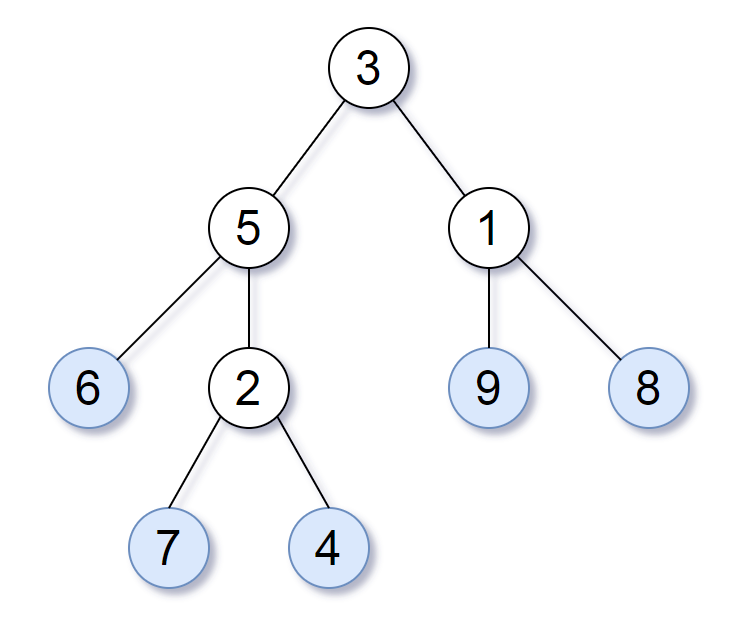
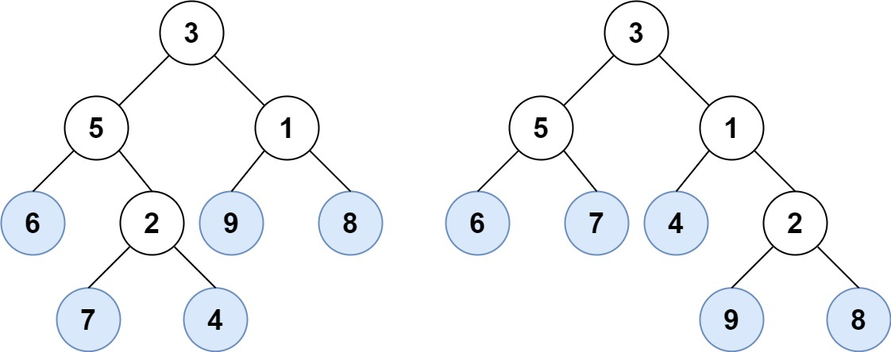
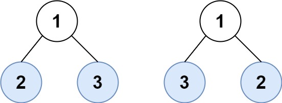

# 872. Leaf-Similar Trees <Badge type="tip" text="Easy" />

Consider all the leaves of a binary tree, from left to right order, the values of those leaves form a **leaf value sequence**.



For example, in the given tree above, the leaf value sequence is `(6, 7, 4, 9, 8)`.

Two binary trees are considered *leaf-similar* if their leaf value sequence is the same.

Return `true` if and only if the two given trees with head nodes `root1` and `root2` are leaf-similar.

> Example 1:  
Input: root1 = [3,5,1,6,2,9,8,null,null,7,4], root2 = [3,5,1,6,7,4,2,null,null,null,null,null,null,9,8]  
Output: true



> Example 2:  
Input: root1 = [1,2,3], root2 = [1,3,2]  
Output: false



## Approach

**Input:** The root nodes of two binary trees `root1` and `root2`.

**Output:** Determine whether the leaf nodes of these two trees are similar

This problem belongs to **Binary Tree Traversal** problems.

We can define a recursive depth-first traversal function `dfs`. During the traversal process, we determine if a node is a leaf node and record it down. Finally we judge whether the two trees' leaf sequences are similar.

The key point is the logic for identifying a leaf node: `if not node.left and not node.right`.

## Implementation

::: code-group

```python
class Solution:
    def leafSimilar(self, root1: Optional[TreeNode], root2: Optional[TreeNode]) -> bool:
        # Used to store the leaf node sequences of the two trees
        leaves1 = []
        leaves2 = []

        # Define DFS function to collect leaf nodes
        def dfs(node, leaves):
            if not node:
                return
            # If the current node is a leaf node, add it to the sequence
            if not node.left and not node.right:
                leaves.append(node.val)
            # Recursively traverse the left subtree
            dfs(node.left, leaves)
            # Recursively traverse the right subtree
            dfs(node.right, leaves)
        
        # Get the leaf node sequences for both trees
        dfs(root1, leaves1)
        dfs(root2, leaves2)
        
        # Compare if the two sequences are identical
        return leaves1 == leaves2
```

```javascript
/**
 * @param {TreeNode} root1
 * @param {TreeNode} root2
 * @return {boolean}
 */
var leafSimilar = function(root1, root2) {
    const leaves1 = [];
    const leaves2 = [];

    function dfs(node, leaves) {
        if (!node) return;

        if (!node.left && !node.right) {
            leaves.push(node.val);
        }

        dfs(node.left, leaves);
        dfs(node.right, leaves);
    }

    dfs(root1, leaves1);
    dfs(root2, leaves2);

    if (leaves1.length !== leaves2.length) return false;

    for (let i = 0; i < leaves1.length; i++) {
        if (leaves1[i] !== leaves2[i]) return false;
    }
    
    return true;
};
```

:::

## Complexity Analysis

- Time Complexity: `O(n)`
- Space Complexity: `O(h)`, where `h` is the height of the tree

## Links

[872. Leaf-Similar Trees (English)](https://leetcode.com/problems/leaf-similar-trees/description/)

[872. 叶子相似的树 (Chinese)](https://leetcode.cn/problems/leaf-similar-trees/description/)
