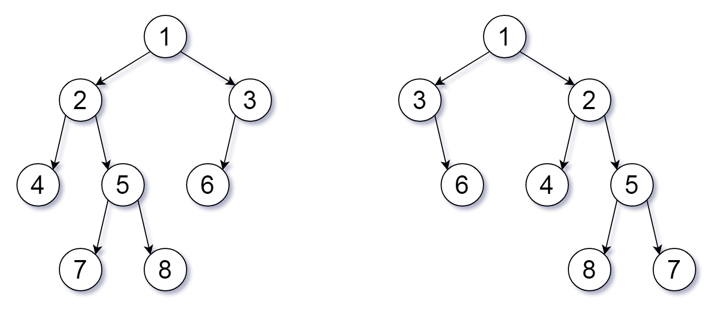

# 951. Flip Equivalent Binary Trees <Badge type="warning" text="Medium" />

For a binary tree **T**, we can define a **flip operation** as follows: choose any node, and swap the left and right child subtrees.

A binary tree **X** is *flip equivalent* to a binary tree **Y** if and only if we can make **X** equal to **Y** after some number of flip operations.

Given the roots of two binary trees `root1` and `root2`, return `true` if the two trees are flip equivalent or `false` otherwise.

> Example 1:  
Input: root1 = [1,2,3,4,5,6,null,null,null,7,8], root2 = [1,3,2,null,6,4,5,null,null,null,null,8,7]  
Output: true  
Explanation: We flipped at nodes with values 1, 3, and 5.



> Example 2:  
Input: root1 = [], root2 = []  
Output: true

> Example 3:  
Input: root1 = [], root2 = [1]  
Output: false

## Approach

**Input:** The root nodes of two binary trees `root1` and `root2`.

**Output:** Determine if the two binary trees can be equivalent through flipping.

This problem can be solved using **Bottom-up DFS**.

* The key to this problem is that it is not mandatory to flip every subtree.
* As long as you can get the same tree without flipping, you don't have to flip.
* Flip only if flipping results in the same tree.
* So you have to compare both the unflipped result and the flipped result.
* Meeting either one of them is enough.

We can recursively traverse and compare whether these two trees are equal when flipped and not flipped to get the answer.

## Implementation

::: code-group

```python
class Solution:
    def flipEquiv(self, root1: Optional[TreeNode], root2: Optional[TreeNode]) -> bool:
        def dfs(node1, node2):
            # If both nodes are null, structural match, return True
            if not node1 and not node2:
                return True

            # If one is null and the other isn't, or values are different, they are not equivalent
            if not node1 or not node2 or node1.val != node2.val:
                return False

            # Case 1: No flip, left and right subtrees match respectively
            no_flip = dfs(node1.left, node2.left) and dfs(node1.right, node2.right)

            # Case 2: Left and right subtrees match after flipping
            flip = dfs(node1.left, node2.right) and dfs(node1.right, node2.left)

            # Return true if either case is satisfied
            return no_flip or flip

        return dfs(root1, root2)
```

```javascript
/**
 * @param {TreeNode} root1
 * @param {TreeNode} root2
 * @return {boolean}
 */
var flipEquiv = function(root1, root2) {
    function dfs(node1, node2) {
        if (node1 == null && node2 == null)
            return true;

        if (node1 == null || node2 == null || node1.val !== node2.val)
            return false;

        const noFlip = dfs(node1.left, node2.left) && dfs(node1.right, node2.right)

        const flip = dfs(node1.left, node2.right) && dfs(node1.right, node2.left)

        return noFlip || flip
    }

    return dfs(root1, root2)
};
```

:::

## Complexity Analysis

- Time Complexity: `O(n)`
- Space Complexity: `O(h)`, where `h` is the height of the tree

## Links

[951. Flip Equivalent Binary Trees (English)](https://leetcode.com/problems/flip-equivalent-binary-trees/description/)

[951. 翻转等价二叉树 (Chinese)](https://leetcode.cn/problems/flip-equivalent-binary-trees/description/)
