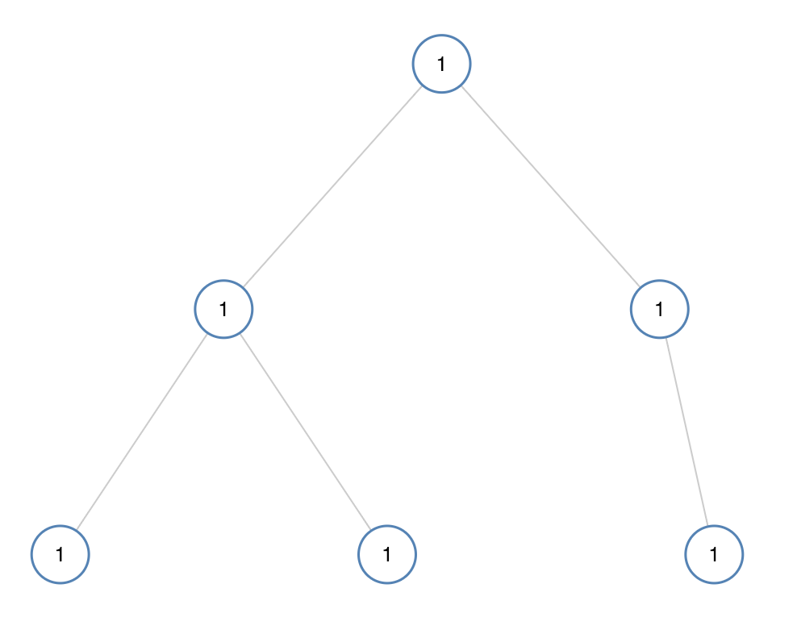
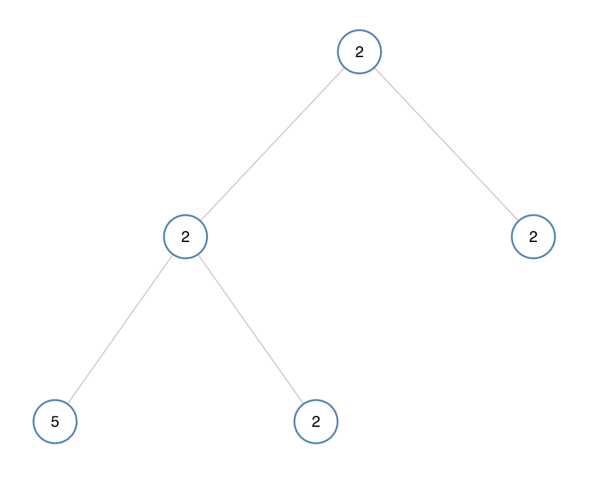

# 965. Univalued Binary Tree <Badge type="tip" text="Easy" />

A binary tree is **univalued** if every node in the tree has the same value.

Return `true` if and only if the given tree is univalued.

> Example 1:  
Input: [1,1,1,1,1,null,1] 
Output: true



> Example 2:  
Input: [2,2,2,5,2]  
Output: false



## Approach

**Input:** The root node of a binary tree `root`.

**Output:** Determine if all values in the tree are the same, meaning it is a univalued binary tree

This problem can be solved by using either **Top-down DFS** or **Bottom-up DFS**.

### Bottom-up DFS

The characteristic of **Bottom-up DFS** is to **recurse down to the leaf nodes first, then return level by level, processing information, with each level relying on its child nodes' returned results to compute the current node's result**.

So we can think when reaching the last subtree, we only need to compare whether the node is different from its left and right child nodes.

When it's different from the left node, it returns `False`. The same logic applies to comparing with the right node.

If there is no left or right node, there is no need to compare, because having only one value is definitely `True`.

Then recursively evaluate if both left and right subtrees return `True`.

### Top-down DFS

In the **Top-down DFS** approach, we can pass the current node down to the child nodes for comparison. As soon as a child node is found inconsistent with the parent node, we return `False`.

Then recursively evaluate if the left subtree and the right subtree both return `True`.

The biggest difference from bottom-up is whether parameters need to be passed down. Top-down requires comparing the current node to the parent node, while bottom-up involves comparing the current node to its children.

## Implementation

### Bottom-up DFS

::: code-group

```python
# Bottom-up approach
class Solution:
    def isUnivalTree(self, root: Optional[TreeNode]) -> bool:
        def dfs(node):
            # An empty node is by default a univalued tree
            if not node:
                return True

            # If the left child exists and its value is different, return False
            if node.left and node.left.val != node.val:
                return False

            # If the right child exists and its value is different, return False
            if node.right and node.right.val != node.val:
                return False

            # Recursively evaluate if the left and right subtrees are univalued
            return dfs(node.left) and dfs(node.right)

        return dfs(root)
```

```javascript
/**
 * @param {TreeNode} root
 * @return {boolean}
 */
var isUnivalTree = function(root) {
    function dfs(node) {
        if (!node) return true;

        if (node.left && node.val !== node.left.val) 
            return false;

        if (node.right && node.val !== node.right.val) 
            return false;
        
        return dfs(node.left) && dfs(node.right);
    }

    return dfs(root);
};
```

### Top-down DFS

::: code-group

```python
# Top-down approach
def isUnivalTree(self, root: Optional[TreeNode]) -> bool:
    # If the tree is empty, return True directly, as an empty tree meets the definition
    if not root:
        return True
    
    # DFS to check if node values are the same as their parent
    def dfs(node: Optional[TreeNode], parentVal: int) -> bool:
        # If node is empty, return True (Base case)
        if not node:
            return True
        
        # If current node value differs from the parent's value, return False
        if node.val != parentVal:
            return False
        
        # Recursively check the left and right subtrees, passing the current node's value as the parent value
        left = dfs(node.left, node.val)
        right = dfs(node.right, node.val)
        
        # Return True if both left and right subtrees return True, otherwise False
        return left and right
    
    # Start from the root node, passing its value as the initial parent value
    return dfs(root, root.val)
```

```javascript
/**
 * @param {TreeNode} root
 * @return {boolean}
 */
var isUnivalTree = function(root) {
    function dfs(node, parentVal) {
        if (!node) return true;

        if (node.val !== parentVal)
            return false
        
        return dfs(node.left, node.val) && dfs(node.right, node.val);
    }

    return dfs(root, root.val);
};
```

:::

## Complexity Analysis

- Time Complexity: `O(n)`
- Space Complexity: `O(h)`, where `h` is the height of the tree

## Links

[965. Univalued Binary Tree (English)](https://leetcode.com/problems/univalued-binary-tree/description/)

[965. 单值二叉树 (Chinese)](https://leetcode.cn/problems/univalued-binary-tree/description/)
