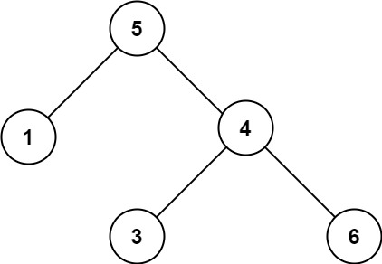

# 98. Validate Binary Search Tree <Badge type="warning" text="Medium" />

Given the `root` of a binary tree, *determine if it is a valid binary search tree (BST)*.

A **valid BST** is defined as follows:

* The left subtree of a node contains only nodes with keys **less than** the node's key.
* The right subtree of a node contains only nodes with keys **greater than** the node's key.
* Both the left and right subtrees must also be binary search trees.

> Example 1:  
Input: root = [2,1,3]  
Output: true


> Example 2:  
Input: root = [5,1,4,null,null,3,6]  
Output: false  
Explanation: The root node's value is 5 but its right child's value is 4.




## Approach

**Input:** The root node of a binary tree `root`

**Output:** Determine if this tree is a valid Binary Search Tree (BST)

This problem belongs to **Top-down DFS** problems.

We can recursively pass down the valid value range (left bound and right bound) for each node, and check if the current node's value falls within the valid range:

* For each node, the requirement is: all node values in the left subtree must be strictly less than the current node's value, and all node values in the right subtree must be strictly greater than the current node's value.
* If a node's value is not in the valid interval, immediately return False, meaning it's not a BST.
* When recursively checking the left and right subtrees, we update the left and right bounds:
  * The upper bound of the left subtree is the current node's value.
  * The lower bound of the right subtree is the current node's value.


## Implementation

::: code-group

```python
class Solution:
    def isValidBST(self, root: Optional[TreeNode]) -> bool:
        """
        Check if a binary tree is a valid Binary Search Tree (BST)
        Idea: Use interval constraints, recursively validating if each node conforms to the definition of a BST
        """
        def dfs(node, left, right):
            """
            Depth-first traversal (recursion)
            node: current node
            left: lower bound of current node's value (must be greater than)
            right: upper bound of current node's value (must be less than)
            """
            if not node:
                return True  # Empty node is naturally valid

            # If the current node value is not within the (left, right) interval, it is not a BST
            if not (left < node.val < right):
                return False

            # Check left subtree, the upper bound for the left subtree is the current node's value
            isLeftValid = dfs(node.left, left, node.val)
            if not isLeftValid:
                return False

            # Check right subtree, the lower bound for the right subtree is the current node's value
            isRightValid = dfs(node.right, node.val, right)
            if not isRightValid:
                return False

            # Both subtrees are valid
            return True
        
        # Initial call, left bound is negative infinity, right bound is positive infinity
        return dfs(root, float('-inf'), float('inf'))
```

```javascript
/**
 * @param {TreeNode} root
 * @return {boolean}
 */
var isValidBST = function(root) {
    function dfs(node, left, right) {
        if (!node) return true;

        if (node.val <= left || node.val >= right) {
            return false;
        }

        const isLeftValid = dfs(node.left, left, node.val);
        if (!isLeftValid) return false;

        const isRightValid = dfs(node.right, node.val, right);

        return isRightValid;
    }

    return dfs(root, -Infinity, Infinity);
};
```

:::

## Complexity Analysis

- Time Complexity: `O(n)`
- Space Complexity: `O(h)`

## Links

[98. Validate Binary Search Tree (English)](https://leetcode.com/problems/validate-binary-search-tree/description/)

[98. 验证二叉搜索树 (Chinese)](https://leetcode.cn/problems/validate-binary-search-tree/description/)
