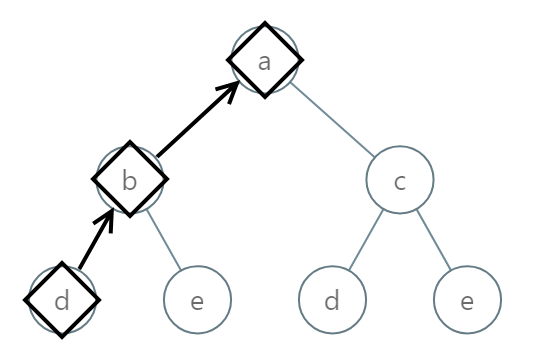
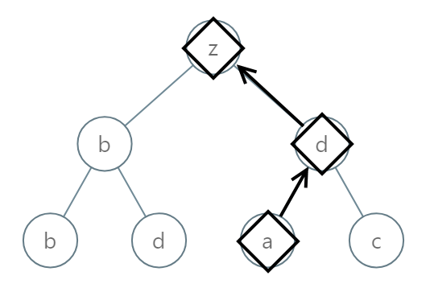
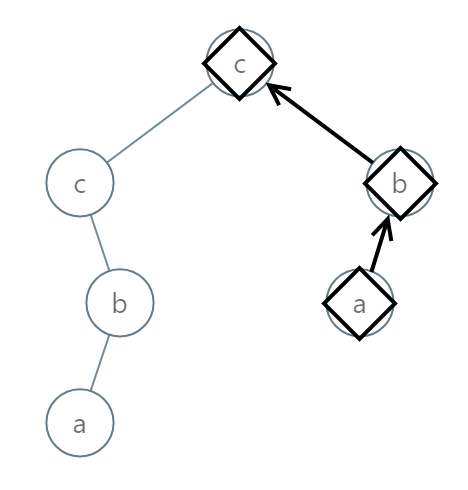

# 988. Smallest String Starting From Leaf <Badge type="warning" text="Medium" />

You are given the `root` of a binary tree where each node has a value in the range `[0, 25]` representing the letters `'a'` to `'z'`.

Return *the **lexicographically smallest** string that starts at a leaf of this tree and ends at the root*.

As a reminder, any shorter prefix of a string is **lexicographically smaller**.

* For example, `"ab"` is lexicographically smaller than `"aba"`.

A leaf of a node is a node that has no children.

> Example 1:  
Input: root = [0,1,2,3,4,3,4] 
Output: "dba"



> Example 2:  
Input: root = [25,1,3,1,3,0,2] 
Output: "adz"



> Example 3:  
Input: root = [2,2,1,null,1,0,null,0] 
Output: "abc"



## Approach

**Input:** The root node of a binary tree `root`.

**Output:** Form a string from leaf node to root node, returning the lexicographically smallest string.

This problem belongs to **Top-down DFS** problems.

During our DFS traversal, we can pass down the previously accumulated string. Eventually, when we reach a leaf node, a complete string is formed.

Finally, we return the lexicographically smaller string between the ones formed by the left and right subtrees. If one subtree returns null (meaning it had no child subtree), we directly return the result from the non-empty subtree.

## Implementation

::: code-group

```python
class Solution:
    def smallestFromLeaf(self, root: Optional[TreeNode]) -> str:
        def dfs(node, path):
            if not node:
                return None  # Missing node does not form a string

            # Convert the current node's value into the corresponding character (0 -> 'a', 1 -> 'b', ..., 25 -> 'z')
            current_char = chr(ord('a') + node.val)
            path = current_char + path  # Since it's from leaf to root, character is prepended

            # If it's a leaf node, return the current path string directly
            if not node.left and not node.right:
                return path

            # Recurse on the left subtree and right subtree
            left = dfs(node.left, path)
            right = dfs(node.right, path)

            # Return the non-empty string which is lexicographically smaller
            if left and right:
                return min(left, right)
            return left or right  # If one is empty, return the other
        
        return dfs(root, "")
```

```javascript
/**
 * @param {TreeNode} root
 * @return {string}
 */
var smallestFromLeaf = function(root) {
    function dfs(node, path) {
        if (!node) return;

        const currentChar = String.fromCharCode('a'.charCodeAt(0) + node.val);
        const currentPath = currentChar + path;
        if (!node.left && !node.right) {
            return currentPath;
        }

        const left = dfs(node.left, currentPath);
        const right = dfs(node.right, currentPath);

        if (left && right)
            return left < right ? left : right;
        
        return left || right;
    }

    return dfs(root, "");
};
```

:::

## Complexity Analysis

- Time Complexity: `O(n)`
- Space Complexity: `O(h)`, where `h` is the height of the tree

## Links

[988. Smallest String Starting From Leaf (English)](https://leetcode.com/problems/smallest-string-starting-from-leaf/description/)

[988. 从叶结点开始的最小字符串 (Chinese)](https://leetcode.cn/problems/smallest-string-starting-from-leaf/description/)
