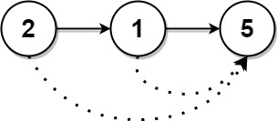
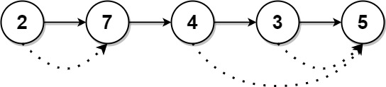

# 1019. Next Greater Node In Linked List <Badge type="warning" text="Medium" />

You are given the `head` of a linked list with `n` nodes.

For each node in the list, find the value of the **next greater node**. That is, for each node, find the value of the first node that is next to it and has a **strictly larger** value than it.

Return an integer array `answer` where `answer[i]` is the value of the next greater node of the `i^{th}` node (**1-indexed**). If the `i^{th}` node does not have a next greater node, set `answer[i] = 0`.

> Example 1:  
Input: head = [2,1,5]   
Output: [5,5,0]



> Example 2:  
Input: head = [2,7,4,3,5]   
Output: [7,0,5,5,0]



## Approach

**Input:** A linked list `head`

**Output:** Return an array representing the next strictly greater value encountered for the `i`-th node; set to 0 if none exists.

This problem belongs to the **Linked List + Monotonic Stack** category.

We can transform this problem into a monotonic stack problem:

- First, we traverse the linked list and store all the values into an array.
- Use a stack to save the indices of elements for which a greater value has not yet been found.
- Every time we traverse to the next element, we compare its magnitude with the value corresponding to the last index in the stack.
- As long as the current value is greater than the stack top element's value (or until the stack is empty), we pop the top index. The stack will only retain indices of elements that haven't found a greater value yet. This forms a monotonic stack.
- Whenever the value corresponding to the index in the stack is smaller than the current element, directly modify `answer[i] = val`.

## Implementation

::: code-group

```python
class Solution:
    def nextLargerNodes(self, head: Optional[ListNode]) -> List[int]:
        # Step 1: Convert the linked list into an array first to easily access by index
        values = []
        curr = head
        while curr:
            values.append(curr.val)
            curr = curr.next

        # Step 2: Initialize result array, default to 0 (meaning no greater value found)
        res = [0] * len(values)
        stack = []  # Monotonic stack, the stack stores indices instead of values

        # Step 3: Traverse the array and use monotonic stack to find the "next greater value"
        for i, val in enumerate(values):
            # If current value is greater than the value at the stack's top index, a greater value is found
            while stack and values[stack[-1]] < val:
                idx = stack.pop()     # Pop the top index
                res[idx] = val        # The current value is its "next greater value"

            # Push the current index into the stack, waiting for a larger element to update it
            stack.append(i)

        return res
```

```javascript
/**
 * @param {ListNode} head
 * @return {number[]}
 */
var nextLargerNodes = function(head) {
    let curr = head;
    const values = [];
    while (curr) {
        values.push(curr.val);
        curr = curr.next;
    }

    const ans = new Array(values.length).fill(0);
    const stack = [];

    values.forEach((item, index) => {
        while (stack.length && values[stack[stack.length - 1]] < item) {
            const idx = stack.pop();
            ans[idx] = item;
        }

        stack.push(index);
    });

    return ans;
};
```

:::

## Complexity Analysis

- Time Complexity: `O(n)`
- Space Complexity: `O(n)`

## Links

[1019. Next Greater Node In Linked List (English)](https://leetcode.com/problems/next-greater-node-in-linked-list/)

[1019. 链表中的下一个更大节点 (Chinese)](https://leetcode.cn/problems/next-greater-node-in-linked-list/)
