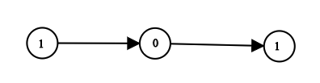

# 1290. Convert Binary Number in a Linked List to Integer <Badge type="tip" text="Easy" />

Given `head` which is a reference node to a singly-linked list. The value of each node in the linked list is either `0` or `1`. The linked list holds the binary representation of a number.

Return the *decimal value* of the number in the linked list.

The **most significant bit** is at the head of the linked list.



> Example 1:  
Input: head = [1,0,1]  
Output: 5  
Explanation: (101) in base 2 = (5) in base 10

> Example 2:  
Input: head = [0]  
Output: 0 

> Example 3:  
Input: head = [1]  
Output: 1  

> Example 4:  
Input: head = [1,0,0,1,0,0,1,1,1,0,0,0,0,0,0]  
Output: 18880

> Example 5:  
Input: head = [0,0]  
Output: 0

## Approach

**Input:** A linked list `head` representing a binary number, where each node's value is `0` or `1`

**Output:** Return the decimal integer corresponding to the binary number represented by the linked list

This problem belongs to the **Linked List Traversal** category. We need to sequentially read the value of each node from left to right, and convert it to decimal according to binary rules.

**Method 1: Construct integer using bitwise operations (Recommended)**

* Use a variable `result` to record the current result. Every time a node is traversed, shift `result` left by one bit (i.e. `result << 1`, which is equivalent to multiplying by 2), and add the current node's value (i.e. `curr.val`).
* The complete operation is: `result = (result << 1) | curr.val`.
* When the traversal is completed, `result` is the final decimal value.

This method does not require extra space. The time complexity is `O(n)`, and space complexity is `O(1)`.

**Method 2: Splice a string and then convert to decimal**

During traversing, we can also splice the node values into a binary string `s`, and then convert it into a decimal integer utilizing a method like `int(s, 2)` when the traversal ends.

This approach is extremely intuitive but involves string appending, making it slightly less performant than Method 1.

## Implementation

::: code-group

```python
class Solution:
    def getDecimalValue(self, head: Optional[ListNode]) -> int:
        result = 0  # Initialize result to 0
        curr = head

        # Traverse the list, shifting left to construct the binary representation into an integer
        while curr:
            # Left shift by one bit (equivalent to * 2), and bitwise OR the current value
            result = (result << 1) | curr.val  
            curr = curr.next
        
        return result
```

```javascript
/**
 * @param {ListNode} head
 * @return {number}
 */
const getDecimalValue = function(head) {
    let curr = head;
    let result = 0; // Initialize result to 0

    // Traverse the list
    while (curr != null) {
        // Left shift by 1 and bitwise OR the current value
        result = (result << 1) | curr.val; 
        curr = curr.next;
    }
    
    return result;
};
```

:::

## Complexity Analysis

- Time Complexity: `O(n)`
- Space Complexity: `O(1)`

## Links

[1290. Convert Binary Number in a Linked List to Integer (English)](https://leetcode.com/problems/convert-binary-number-in-a-linked-list-to-integer/description/)

[1290. 二进制链表转整数 (Chinese)](https://leetcode.cn/problems/convert-binary-number-in-a-linked-list-to-integer/description/)
