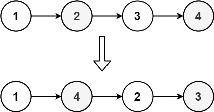
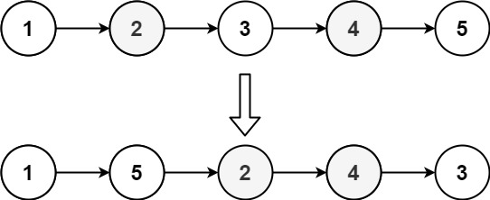

# 143. Reorder List <Badge type="warning" text="Medium" />

You are given the head of a singly linked-list. The list can be represented as:

`L0 → L1 → … → Ln - 1 → Ln`

*Reorder the list to be on the following form:*

`L0 → Ln → L1 → Ln - 1 → L2 → Ln - 2 → …`

You may not modify the values in the list's nodes. Only nodes themselves may be changed.

> Example 1:  
Input: head = [1,2,3,4]   
Output: [1,4,2,3]



> Example 2:  
Input: head = [1,2,3,4,5]   
Output: [1,5,2,4,3]



## Approach

**Input:** A linked list `head`

**Output:** Reorder the linked list, requiring alternating arrangement of head and tail items `L0 → Ln → L1 → Ln - 1 → L2 → Ln - 2 → …`

This problem belongs to the **Linked List Reordering** category.

This problem can be solved in three steps:

1. Use fast and slow pointers to find the middle point of the linked list.
2. Reverse the second half of the linked list starting from the middle point.
3. Alternately merge the entire linked list.
    - First half: `1 → 2 → 3`
    - Second half reversed: `6 → 5 → 4`
    - Alternating merge: `1 → 6 → 2 → 5 → 3 → 4`

## Implementation

::: code-group

```python
def middleNode(head):
    slow, fast = head, head
    while fast and fast.next:
        fast = fast.next.next
        slow = slow.next
    return slow

def reverseList(head):
    pre, cur = None, head
    while cur:
        nxt = cur.next
        cur.next = pre
        pre = cur
        cur = nxt
    return pre

class Solution:
    def reorderList(self, head: Optional[ListNode]) -> None:
        # First find the middle node
        mid = middleNode(head)
        # Reversing the second half (nodes after middle node) to get a trailing head, which leads all the way backward to the middle node
        # 1(head) -> 2 -> 3 <- 4 <- 5(head2)
        head2 = reverseList(mid)
        # Loop from head2 until finding the mid node, because mid points to None after reversing
        while head2.next:
            # 1(head) -> 2 -> 3 -> 4 -> 5
            # 5(head2) -> 4 -> 3(mid)
            # Save the next node of head
            nxt = head.next
            # Save the next node of head2
            nxt2 = head2.next
            # Make head next node point to head2: 1 -> 5
            head.next = head2
            # Make head2 next node point to head.next: 5 -> 2
            head2.next = nxt
            # Move head to its original next node
            head = nxt
            # Move head2 to its original next node
            head2 = nxt2

        # ----------- Stack alternative approach ----------- #
        # curr = head
        # stack = []

        # # Backup the linked list elements in a stack
        # while curr:
        #     stack.append(curr)
        #     curr = curr.next
        
        # curr = head
        # while stack:
        #     nxt = curr.next
        #     # Continuously retrieve nodes from the back using the stack
        #     stackNxt = stack.pop()

        #     # When meeting, there are even and odd situations where we must exit
        #     # 1 -> 2(nxt | stackNxt)
        #     if nxt == stackNxt:
        #         nxt.next = None
        #         break

        #     # 1 -> 2(curr | stackNxt) -> 3(nxt)
        #     if curr == stackNxt:
        #         curr.next = None
        #         break
        #     # Otherwise, point current node's next to the end node: 1 -> 5
        #     curr.next = stackNxt
        #     # Point the end node's next to nxt: 5 -> 2
        #     stackNxt.next = nxt
        #     # Move the current node
        #     curr = nxt
        # return head
```

```javascript
/**
 * @param {ListNode} head
 * @return {void} Do not return anything, modify head in-place instead.
 */
var reorderList = function(head) {
    function middleNode(head) {
        let slow = head;
        let fast = head;

        while (fast && fast.next) {
            slow = slow.next;
            fast = fast.next.next;
        }

        return slow;
    }

    function reverseList(head) {
        let pre = null;
        let curr = head;
        while (curr) {
            const nxt = curr.next;
            curr.next = pre;
            pre = curr;
            curr = nxt;
        }

        return pre;
    }

    let mid = middleNode(head);
    let head2 = reverseList(mid);

    while (head2.next) {
        const nxt = head.next;
        const nxt2 = head2.next;

        head.next = head2;
        head2.next = nxt;
        head = nxt;
        head2 = nxt2;
    }
};
```

:::

## Complexity Analysis

- Time Complexity: `O(n)`
- Space Complexity: `O(1)`

## Links

[143. Reorder List (English)](https://leetcode.com/problems/reorder-list/description/)

[143. 重排链表 (Chinese)](https://leetcode.cn/problems/reorder-list/description/)
