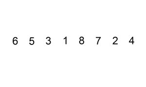
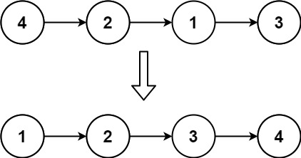
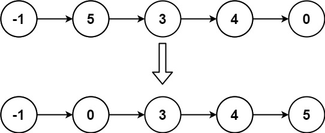

# 147. Insertion Sort List <Badge type="warning" text="Medium" />

Given the `head` of a singly linked list, sort the list using **insertion sort**, and return *the sorted list's head*.

The steps of the **insertion sort** algorithm:

1. Insertion sort iterates, consuming one input element each repetition and growing a sorted output list.
2. At each iteration, insertion sort removes one element from the input data, finds the location it belongs within the sorted list and inserts it there.
3. It repeats until no input elements remain.

The following is a graphical example of the insertion sort algorithm. The partially sorted list (black) initially contains only the first element in the list. One element (red) is removed from the input data and inserted in-place into the sorted list with each iteration.

Sort a linked list using insertion sort.



> Example 1:  
Input: head = [4,2,1,3]  
Output: [1,2,3,4]



> Example 2:  
Input: head = [-1,5,3,4,0]  
Output: [-1,0,3,4,5]



## Approach

**Input:** A linked list `head`

**Output:** Perform insertion sort on the linked list and return the final sorted list head

This problem belongs to the **Linked List Insertion and Reordering** category.

We need to use a `dummy` node. Each time an element is sorted, it will be inserted into the correct position relative to this growing sorted list.

During the sorting process, we need to record the next node of the current node: `currNext = curr.next`.

For each element `curr`, start traversing from the `dummy` node, denoted as `prev`, until we find a `prev.next` that is larger than `curr.val`. Then, stop and insert the current node at that position: `prev -> curr -> prev.next`.

After inserting, continue the iteration from `currNext`.

Finally, return `dummy.next`.

## Implementation

::: code-group

```python
class Solution:
    def insertionSortList(self, head: Optional[ListNode]) -> Optional[ListNode]:
        # Create a dummy node to simplify insertion logic at the head
        dummy = ListNode(0)

        # curr represents the current node of the unsorted list
        curr = head

        # Traverse the original linked list
        while curr:
            # Save the next node for the subsequent iteration
            currNext = curr.next

            # From dummy, look for the correct insertion position (prev is curr's predecessor)
            prev = dummy
            while prev.next and prev.next.val < curr.val:
                prev = prev.next  # Move forward until a value greater than or equal to curr is found

            # Complete the insertion:
            # First, save the original next of prev
            prevNext = prev.next

            # Insert curr between prev and prevNext
            prev.next = curr
            curr.next = prevNext

            # Continue to process the next node in the original linked list
            curr = currNext

        # Return the head of the sorted linked list (dummy.next)
        return dummy.next
```

```javascript
/**
 * @param {ListNode} head
 * @return {ListNode}
 */
var insertionSortList = function(head) {
    const dummy = new ListNode();

    let curr = head;
    while (curr != null) {
        let prev = dummy;
        const currNext = curr.next;

        while (prev.next && prev.next.val < curr.val) {
            prev = prev.next
        }

        prevNext = prev.next;
        prev.next = curr;
        curr.next = prevNext;
        curr = currNext;
    }

    return dummy.next;
};
```

:::

## Complexity Analysis

- Time Complexity: `O(n^2)`
- Space Complexity: `O(1)`

## Links

[147. Insertion Sort List (English)](https://leetcode.com/problems/insertion-sort-list/description/)

[147. 对链表进行插入排序 (Chinese)](https://leetcode.cn/problems/insertion-sort-list/description/)
