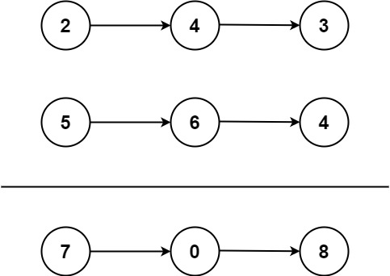

# 2. Add Two Numbers <Badge type="warning" text="Medium" />

You are given two **non-empty** linked lists representing two non-negative integers. The digits are stored in **reverse order**, and each of their nodes contains a single digit. Add the two numbers and return the sum as a linked list.

You may assume the two numbers do not contain any leading zero, except the number 0 itself.



> Example 1:  
Input: l1 = [2,4,3], l2 = [5,6,4]  
Output: [7,0,8]   
Explanation: 342 + 465 = 807.

> Example 2:  
Input: l1 = [0], l2 = [0]   
Output: [0]

> Example 3:  
Input: l1 = [9,9,9,9,9,9,9], l2 = [9,9,9,9]   
Output: [8,9,9,9,0,0,0,1]

## Approach

**Input:** Two linked lists `l1` and `l2`, each node storing a single digit

**Output:** Return a new linked list representing their sum

This problem belongs to the **Merge Linked List** category.

- We need a variable `carry` to store the carry-over value from addition. Since the maximum single digit is 9, `carry` will only be 0 or 1.
- Create a virtual head node `dummy`: its `.next` points to the final answer linked list.
- Traverse both linked lists `l1` and `l2` until both are empty and the `carry` is also 0: `while l1 or l2 or carry:`
- Extract the values of the current digits `val1`, `val2`.
- Calculate the total sum: `total = val1 + val2 + carry`.
- The current node value is: `nodeVal = total % 10`.
- Update the carry value: `carry = total // 10`.
- Insert the current digit result into the result linked list: `curr.next = ListNode(nodeVal)`.

Finally, return `dummy.next`, which is the head of the result linked list.

## Implementation

::: code-group

```python
class Solution:
    def addTwoNumbers(self, l1: Optional[ListNode], l2: Optional[ListNode]) -> Optional[ListNode]:
        # Create a dummy node to facilitate subsequent operations
        dummy = ListNode(0)
        curr = dummy  # Pointer used to build the result linked list
        carry = 0     # Carry cache

        # Traverse both linked lists until both are empty and there is no carry
        while l1 or l2 or carry:
            # Extract the values of the two nodes respectively, treating them as 0 if empty
            val1 = l1.val if l1 else 0
            val2 = l2.val if l2 else 0

            # Sum of the two values plus carry
            total = val1 + val2 + carry
            carry = total // 10     # Update carry (0 or 1)
            node_val = total % 10   # Value of the current digit

            # Build a new node, add it to the result linked list
            curr.next = ListNode(node_val)
            curr = curr.next  # Move pointer forward

            # Move the pointers of the two input linked lists
            if l1:
                l1 = l1.next
            if l2:
                l2 = l2.next

        # Return the next node of the dummy node, which is the head of the result linked list
        return dummy.next
```

```javascript
/**
 * @param {ListNode} l1
 * @param {ListNode} l2
 * @return {ListNode}
 */
var addTwoNumbers = function(l1, l2) {
    const dummy = new ListNode(0);
    let curr = dummy;
    let carry = 0;

    while (l1 || l2 || carry) {
        const val1 = l1 ? l1.val : 0;
        const val2 = l2 ? l2.val : 0;

        const total = val1 + val2 + carry;
        const nodeVal = total % 10;
        carry = Math.floor(total / 10);

        curr.next = new ListNode(nodeVal);
        curr = curr.next;

        if (l1) {
            l1 = l1.next;
        }

        if (l2) {
            l2 = l2.next;
        }
    }

    return dummy.next;
};
```

:::

## Complexity Analysis

- Time Complexity: `O(max(m, n))`
- Space Complexity: `O(1)` (excluding the returned list)

## Links

[2. Add Two Numbers (English)](https://leetcode.com/problems/add-two-numbers/description/)

[2. 两数相加 (Chinese)](https://leetcode.cn/problems/add-two-numbers/description/)
