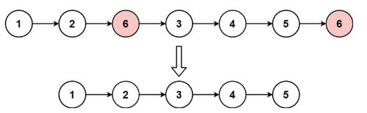

# 203. Remove Linked List Elements <Badge type="tip" text="Easy" />

Given the `head` of a linked list and an integer `val`, remove all the nodes of the linked list that has `Node.val == val`, and return *the new head*.



> Example 1:  
Input: head = [1,2,6,3,4,5,6], val = 6  
Output: [1,2,3,4,5]

> Example 2:  
Input: head = [], val = 1  
Output: []

> Example 3:  
Input: head = [7,7,7,7], val = 7  
Output: []

## Approach

**Input:** A linked list `head`, an integer `val`

**Output:** Remove all nodes in the linked list with value equal to `val`, and return the new head

This problem belongs to the **Linked List Deletion** category. The key is in handling node deletion, especially taking care of the case where the head node might also be deleted.

To simplify the operation, we introduce a **sentinel node `dummy`** and point it to the head of the original linked list (`dummy.next = head`). In this way, regardless of whether the head node is deleted or not, the operational logic can be consistently unified and processed without special branch checks.

Then, we use two pointers:

* `curr` points to the currently traversed node (starting from `head`).
* `prev` points to the predecessor node of `curr` (initially `dummy`).

During the traversal:

* If `curr.val == val`, we point `prev.next` to `curr.next`, skipping the node in the linked list.
* Otherwise, it means the current node is retained, so update `prev = curr`.
* In any case, `curr` moves forward in each round.

Finally, return `dummy.next` as the new linked list head, since the original `head` might have been deleted.

## Implementation

::: code-group

```python
class Solution:
    def removeElements(self, head: Optional[ListNode], val: int) -> Optional[ListNode]:
        # Create a dummy sentinel node, with next pointing to the original linked list head
        dummy = ListNode(next=head)

        # prev is the node before the current node, curr is the current node being traversed
        prev = dummy
        curr = head

        # Traverse the entire linked list
        while curr:
            if curr.val == val:
                # The current node's value equals the target value, delete: prev skips curr
                prev.next = curr.next
            else:
                # Otherwise keep the current node, move prev forward
                prev = curr

            # curr always moves forward
            curr = curr.next

        # Return the linked list head after removing the target value nodes (the node after dummy)
        return dummy.next
```

```javascript
/**
 * @param {ListNode} head
 * @param {number} val
 * @return {ListNode}
 */
const removeElements = function(head, val) {
    // Create a dummy sentinel node, with next pointing to the original linked list head
    const dummy = new ListNode(null, head);

    // prev is the node before the current node, curr is the currently traversed node
    let prev = dummy;
    let curr = head;

    // Traverse the entire linked list
    while (curr != null) {
        if (curr.val == val) {
            // Re-route passing pointer over the node to be deleted
            prev.next = curr.next;
        } else {
            // Otherwise retain the current node, move prev forwards
            prev = curr;
        }

        // curr always moves forwards
        curr = curr.next;
    }

    return dummy.next;
};
```

:::

## Complexity Analysis

- Time Complexity: `O(n)`
- Space Complexity: `O(1)`

## Links

[203. Remove Linked List Elements (English)](https://leetcode.com/problems/remove-linked-list-elements/description/)

[203. 移除链表元素 (Chinese)](https://leetcode.cn/problems/remove-linked-list-elements/description/)
