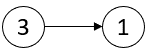
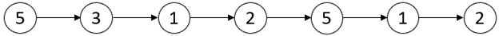
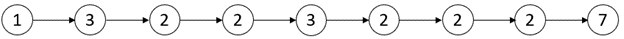
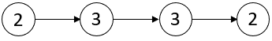

# 2058. Find the Minimum and Maximum Number of Nodes Between Critical Points <Badge type="warning" text="Medium" />

A **critical point** in a linked list is defined as either a **local maxima** or a **local minima**.

A node is a **local maxima** if the current node has a value **strictly greater** than the previous node and the next node.

A node is a **local minima** if the current node has a value **strictly smaller** than the previous node and the next node.

Note that a node can only be a local maxima/minima if there exists **both** a previous node and a next node.

Given a linked list `head`, return *an array of length 2 containing `[minDistance, maxDistance]` where `minDistance` is the **minimum distance** between any **two distinct** critical points and `maxDistance` is the **maximum distance** between any **two distinct** critical points. If there are **fewer** than two critical points, return `[-1, -1]`*.

> Example 1:  
Input: head = [3,1]   
Output: [-1,-1]   
Explanation: There are no critical points in [3,1].



> Example 2:  
Input: head = [5,3,1,2,5,1,2]   
Output: [1,3]  
Explanation: There are three critical points:  
- [5,3,1,2,5,1,2]: The third node is a local minima because 1 is less than 3 and 2.  
- [5,3,1,2,5,1,2]: The fifth node is a local maxima because 5 is greater than 2 and 1.  
- [5,3,1,2,5,1,2]: The sixth node is a local minima because 1 is less than 5 and 2.  
The minimum distance is between the fifth and the sixth node. minDistance = 6 - 5 = 1.  
The maximum distance is between the third and the sixth node. maxDistance = 6 - 3 = 3.



> Example 3:  
Input: head = [1,3,2,2,3,2,2,2,7]   
Output: [3,3]   
Explanation: There are two critical points:  
- [1,3,2,2,3,2,2,2,7]: The second node is a local maxima because 3 is greater than 1 and 2.  
- [1,3,2,2,3,2,2,2,7]: The fifth node is a local maxima because 3 is greater than 2 and 2.  
Both the minimum and maximum distances are between the second and the fifth node.  
Thus, minDistance and maxDistance is 5 - 2 = 3.  
Note that the last node is not considered a local maxima because it does not have a next node.



> Example 4:  
Input: head = [2,3,3,2]    
Output: [-1,-1]   
Explanation: There are no critical points in [2,3,3,2].



## Approach

**Input:** A linked list `head` containing integers

**Output:** Return the minimum and maximum distances between critical points

This problem belongs to the **Linked List Traversal** category.

We can use an array `critical_points` to store the indices of all critical points.

If we find that the number of critical points is fewer than two, there is no relative distance, so we return `[-1, -1]` directly.

For the minimum distance, we can traverse the entire `critical_points` array, compare the distance between each adjacent critical point, and take the minimum value.

For the maximum distance, we directly subtract the index of the first critical point from the index of the last critical point.

## Implementation

::: code-group

```python
class Solution:
    def nodesBetweenCriticalPoints(self, head: Optional[ListNode]) -> List[int]:
        # Current position index, start checking from the 2nd node (1st node cannot be a critical point)
        pos = 1

        # prev represents previous node, curr represents current node
        prev = head
        curr = head.next

        # Record the positions of all critical points
        critical_points = []

        # Traverse the list until the 2nd to last node (curr.next must exist)
        while curr and curr.next:
            # Determine if curr is a "critical point"
            if (curr.val > prev.val and curr.val > curr.next.val) or \
               (curr.val < prev.val and curr.val < curr.next.val):
                critical_points.append(pos)

            # Move pointers, continue traversing
            prev = curr
            curr = curr.next
            pos += 1

        # If there are fewer than 2 critical points, return [-1, -1]
        if len(critical_points) < 2:
            return [-1, -1]

        # Initialize min distance to positive infinity
        min_distance = float('inf')
        # Max distance: the distance between the first and the last critical point
        max_distance = critical_points[-1] - critical_points[0]

        # Traverse adjacent critical points to find the min distance
        for i in range(1, len(critical_points)):
            min_distance = min(min_distance, critical_points[i] - critical_points[i - 1])

        return [min_distance, max_distance]
```

```javascript
/**
 * Definition for singly-linked list.
 * function ListNode(val, next) {
 *     this.val = (val===undefined ? 0 : val)
 *     this.next = (next===undefined ? null : next)
 * }
 */
/**
 * @param {ListNode} head
 * @return {number[]}
 */
var nodesBetweenCriticalPoints = function(head) {
    const points = [];

    let pos = 1;
    let prev = head;
    let curr = head.next;

    while (curr.next) {
        if ((curr.val > prev.val && curr.val > curr.next.val) || (curr.val < prev.val && curr.val < curr.next.val)) {
            points.push(pos);
        }

        prev = curr;
        curr = curr.next;
        pos++;
    }

    if (points.length < 2) return [-1, -1];

    let minDistance = Infinity;
    for (let i = 1; i < points.length; i++) {
        minDistance = Math.min(minDistance, points[i] - points[i - 1]);
    }

    const maxDistance = points.at(-1) - points[0];

    return [minDistance, maxDistance];
};
```

:::

## Complexity Analysis

- Time Complexity: `O(n)`
- Space Complexity: `O(k)`, where `k` is the number of critical points, `k < n`. This can also be optimized to `O(1)` by only keeping track of the first critical point's position and the most recently seen critical point's position.

## Links

[2058. Find the Minimum and Maximum Number of Nodes Between Critical Points (English)](https://leetcode.com/problems/find-the-minimum-and-maximum-number-of-nodes-between-critical-points/description/)

[2058. 找出临界点之间的最小和最大距离 (Chinese)](https://leetcode.cn/problems/find-the-minimum-and-maximum-number-of-nodes-between-critical-points/description/)
