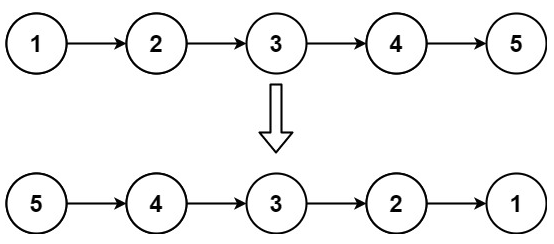

# 206. Reverse Linked List <Badge type="tip" text="Easy" />

Given the `head` of a singly linked list, reverse the list, and return *the reversed list*.



> Example 1:  
Input: head = [1,2,3,4,5]  
Output: [5,4,3,2,1]

> Example 2:  
Input: head = [1,2]  
Output: [2,1]

> Example 3:  
Input: head = []  
Output: []

## Approach

**Input:** A linked list `head`

**Output:** Return the reversed linked list

This problem belongs to the **Linked List Reversal** category. The core is to modify the direction of the pointers node by node.

**Processing Flow:**

1. **Handle edge cases:**
   If the linked list is empty or has only one node, return `head` directly; no reversal is needed.

2. **Initialize two pointers:**
   * `prev`: Represents the previous node of the reversed linked list, initially `None`.
   * `curr`: Represents the node currently being processed, initially `head`.

3. **Traverse and reverse the list:**
   During the traversal, execute these three steps each time:
   * Save the next node: `nxt = curr.next`
   * Modify the current node to point to the previous node: `curr.next = prev`
   * Move both pointers forward: `prev = curr`, `curr = nxt`

4. **Return the reversed linked list head:**
   After the traversal is completed, `curr` is `None`, and `prev` points to the new head node. Just return `prev`.

## Implementation

::: code-group

```python
class Solution:
    def reverseList(self, head: Optional[ListNode]) -> Optional[ListNode]:
        # If the list is empty or has only one node, return directly
        if not head or not head.next:
            return head

        # Initialize two pointers: prev points to the head of reversed portion, curr points to current node
        prev = None
        curr = head

        # Traverse the linked list
        while curr:
            nxt = curr.next     # Save the next node
            curr.next = prev    # Reverse the current node to point to the previous node
            prev = curr         # prev advances to current node
            curr = nxt          # curr advances to next node

        # Finally, prev points to the new head node of the reversed list
        return prev
```

```javascript
/**
 * @param {ListNode} head
 * @return {ListNode}
 */
const reverseList = function(head) {
    // If list is empty or has only one node, return directly
    if (!head || !head.next) return head;

    // Initialize two pointers: prev points to the head of the reversed portion, curr points to current node
    let prev = null;
    let curr = head;

    // Traverse the linked list
    while (curr != null) {
        // Save the next node
        const nxt = curr.next;
        // The current node reverses its pointing to the previous node
        curr.next = prev;
        // prev moves forward to the current node
        prev = curr;
        // curr moves forward to the next node
        curr = nxt;
    }

    // Finally prev points to the new head node after reversal
    return prev;
};
```

:::

## Complexity Analysis

- Time Complexity: `O(n)`
- Space Complexity: `O(1)`

## Links

[206. Reverse Linked List (English)](https://leetcode.com/problems/reverse-linked-list/description/)

[206. 反转链表 (Chinese)](https://leetcode.cn/problems/reverse-linked-list/description/)
