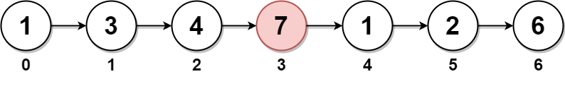

# 2095. Delete the Middle Node of a Linked List <Badge type="warning" text="Medium" />

You are given the `head` of a linked list. **Delete** the **middle node**, and return *the `head` of the modified linked list*.

The **middle node** of a linked list of size `n` is the `⌊n / 2⌋^{th}` node from the **start** using **0-based indexing**, where `⌊x⌋` denotes the largest integer less than or equal to `x`.

For `n` = `1`, `2`, `3`, `4`, and `5`, the middle nodes are `0`, `1`, `1`, `2`, and `2`, respectively.

> Example 1:  
Input: head = [1,3,4,7,1,2,6]   
Output: [1,3,4,1,2,6]   
Explanation:  
The above figure represents the given linked list. The indices of the nodes are written below.  
Since n = 7, node 3 with value 7 is the middle node, which is marked in red.  
We return the new list after removing this node.



> Example 2:  
Input: head = [1,2,3,4]   
Output: [1,2,4]   
Explanation:  
The above figure represents the given linked list.  
For n = 4, node 2 with value 3 is the middle node, which is marked in red.


> Example 3:  
Input: head = [2,1]   
Output: [2]   
Explanation:  
The above figure represents the given linked list.  
For n = 2, node 1 with value 1 is the middle node, which is marked in red.  
Node 0 with value 2 is the only node remaining after removing node 1.


## Approach

**Input:** A linked list `head` containing integers

**Output:** Delete the middle node of the linked list and return the head

This problem belongs to the **Fast and Slow Pointers** category.

We can use fast and slow pointers to quickly find the middle node. Note that we need to delete the middle node here.

Therefore, the slow pointer must find the node *before* the middle node. So it should start from a dummy node, while the fast pointer starts from the head node.

After deleting, return the next node of the dummy node.

## Implementation

::: code-group

```python
class Solution:
    def deleteMiddle(self, head: Optional[ListNode]) -> Optional[ListNode]:
        # Create a dummy node pointing to the head, to handle deleting the head node
        dummy = ListNode(next=head)
        
        # Initialize fast and slow pointers, slow points to dummy, fast points to head
        slow, fast = dummy, head

        # Traverse the list using fast and slow pointers, fast moves 2 steps at a time, slow moves 1 step
        # This way, when fast reaches the end, slow is exactly before the middle node
        while fast and fast.next:
            slow = slow.next
            fast = fast.next.next
        
        # Delete the middle node: point slow's next to its next's next, skipping the middle node
        slow.next = slow.next.next
        
        # Return the list after deletion, dummy.next still points to the head (unless head was deleted)
        return dummy.next
```

```javascript
/**
 * @param {ListNode} head
 * @return {ListNode}
 */
var deleteMiddle = function(head) {
    // Edge case: if list only has one node, return null after deletion
    if (!head.next) return null;

    // Create a dummy node pointing to head to unify operations
    const dummy = new ListNode(null, head);

    // Slow pointer starts from dummy
    // Fast pointer starts from head
    let slow = dummy;
    let fast = head;

    // Fast pointer moves two steps at a time, slow pointer moves one step
    // When fast reaches the end, slow is exactly at the position before the middle node
    while (fast && fast.next) {
        fast = fast.next.next;
        slow = slow.next;
    }

    // Delete the middle node: skip slow.next
    slow.next = slow.next.next;

    // Return the real head node
    return dummy.next;
};
```

:::

## Complexity Analysis

- Time Complexity: `O(n)`
- Space Complexity: `O(1)`

## Links

[2095. Delete the Middle Node of a Linked List (English)](https://leetcode.com/problems/delete-the-middle-node-of-a-linked-list/description/)

[2095. 删除链表的中间节点 (Chinese)](https://leetcode.cn/problems/delete-the-middle-node-of-a-linked-list/description/)
