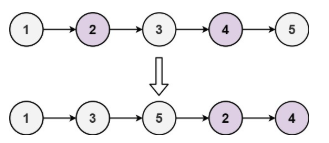
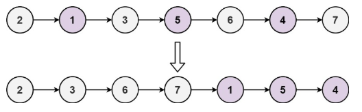

# 328. Odd Even Linked List <Badge type="warning" text="Medium" />

Given the `head` of a singly linked list, group all the nodes with odd indices together followed by the nodes with even indices, and return *the reordered list*.

The **first** node is considered **odd**, and the **second** node is **even**, and so on.

Note that the relative order inside both the even and odd groups should remain as it was in the input.

You must solve the problem in `O(1)` extra space complexity and `O(n)` time complexity.



> Example 1:  
Input: head = [1,2,3,4,5]  
Output: [1,3,5,2,4]



> Example 2:  
Input: head = [2,1,3,5,6,4,7]  
Output: [2,3,6,7,1,5,4]

## Approach

**Input:** A linked list `head`

**Output:** Reorganize the linked list by putting **odd-indexed nodes first, followed by even-indexed nodes**, keeping their relative order unchanged.

This problem belongs to the **Linked List Insertion and Reordering** category. The goal is to reorganize the original linked list into a combination of "odd-positioned nodes + even-positioned nodes".

**Processing Flow:**

1. **Handle edge cases:**
   If the linked list is empty or has only one node, directly return the original linked list.

2. **Initialize three pointers:**
   * `odd` points to the current odd-positioned node (initialized to `head`);
   * `even` points to the current even-positioned node (initialized to `head.next`);
   * `even_head` stores the head of the even linked list (used for concatenation later).

3. **Cross-reorder the linked list:**
   Starting from the even node, traverse until the end (`even` or `even.next` is null):
   * Set `odd.next = even.next`, stepping over the current even node to connect to the next odd node;
   * Move `odd` forward to the new odd node;
   * Set `even.next = odd.next`, stepping over the current odd node to connect to the next even node;
   * Move `even` forward to the new even node.

4. **Concatenate the two sub-lists:**
   After processing all nodes, connect the tail of the odd linked list to the head of the even linked list, i.e., `odd.next = even_head`.

5. **Return the head of the resulting linked list:**
   Finally, return the original `head`, which now points to the correctly ordered linked list.

## Implementation

::: code-group

```python
class Solution:
    def oddEvenList(self, head: Optional[ListNode]) -> Optional[ListNode]:
        # If the list is empty or has only one node, return it directly
        if not head:
            return head

        # odd pointer is initialized to the first node (odd position)
        odd = head
        # even_head is the head of the even nodes, used for connection later
        even_head = head.next
        # even pointer is initialized to the second node (even position)
        even = even_head

        # Loop condition: both the even node and its next node exist
        while even and even.next:
            # Point the next of odd to the next odd node
            odd.next = even.next
            odd = odd.next  # Move odd forward by one step

            # Point the next of even to the next even node
            even.next = odd.next
            even = even.next  # Move even forward by one step

            # Concatenate the tail of the odd list to the head of the even list
        odd.next = even_head

        # Return the head of the reordered list
        return head
```

```javascript
/**
 * @param {ListNode} head
 * @return {ListNode}
 */
const oddEvenList = function(head) {
    // If the list is empty or has only one node, return it directly
    if (!head) return head;

    // odd pointer is initialized to the first node (odd position)
    let odd = head;
    // even_head is the head of the even nodes, used for connection later
    const even_head = head.next;
    // even pointer is initialized to the second node (even position)
    let even = even_head;

    // Loop condition: both the even node and its next node exist
    while (even && even.next) {
        // Point the next of odd to the next odd node
        odd.next = even.next;
        // Move odd forward by one step
        odd = odd.next;

        // Point the next of even to the next even node
        even.next = odd.next;
        // Move even forward by one step
        even = even.next;
    }

    // Concatenate the tail of the odd list to the head of the even list
    odd.next = even_head;

    // Return the head of the reordered list
    return head;
};
```

:::

## Complexity Analysis

- Time Complexity: `O(n)`
- Space Complexity: `O(1)`

## Links

[328. Odd Even Linked List (English)](https://leetcode.com/problems/odd-even-linked-list/description/)

[328. 奇偶链表 (Chinese)](https://leetcode.cn/problems/odd-even-linked-list/description/)
