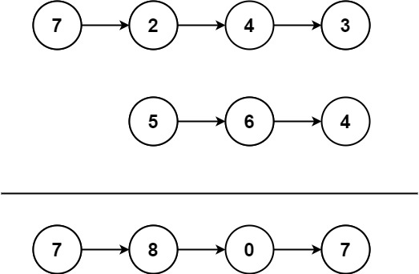

# 445. Add Two Numbers II <Badge type="warning" text="Medium" />

You are given two **non-empty** linked lists representing two non-negative integers. The most significant digit comes first and each of their nodes contains a single digit. Add the two numbers and return the sum as a linked list.

You may assume the two numbers do not contain any leading zero, except the number 0 itself.



> Example 1:  
Input: l1 = [7,2,4,3], l2 = [5,6,4]   
Output: [7,8,0,7]

> Example 2:  
Input: l1 = [2,4,3], l2 = [5,6,4]   
Output: [8,0,7]

> Example 3:  
Input: l1 = [0], l2 = [0]   
Output: [0]

## Approach

**Input:** Two linked lists `l1` and `l2`

**Output:** Merge the two linked lists, performing the addition starting from the tail

This problem belongs to the **Merge Linked List** category.

Since the problem does not allow modifying the original lists (or reversing them), and we need to add starting from the least significant digit (which is at the tail), we can use stacks to simulate reverse access to the linked list.

- Initialize two stacks to respectivel store all the node values of `l1` and `l2` (pushed from head to tail).
- Pop elements from the two stacks sequentially and add them up, handling the `carry` simultaneously.
- Each addition creates a new node, which is then inserted at the head of the resulting linked list using the head insertion method.
- After the loop ends, if `carry` is non-zero, an extra node needs to be created.

## Implementation

::: code-group

```python
class Solution:
    def addTwoNumbers(self, l1: Optional[ListNode], l2: Optional[ListNode]) -> Optional[ListNode]:
        stack1, stack2 = [], []

        # Push all node values of l1 into stack1
        while l1:
            stack1.append(l1.val)
            l1 = l1.next

        # Push all node values of l2 into stack2
        while l2:
            stack2.append(l2.val)
            l2 = l2.next

        carry = 0  # Carry
        head = None  # Resulting linked list's head pointer

        # Simulate addition from lowest placeholder to highest (popping from stacks)
        while stack1 or stack2 or carry:
            val1 = stack1.pop() if stack1 else 0
            val2 = stack2.pop() if stack2 else 0

            total = val1 + val2 + carry
            carry = total // 10  # Update carry
            node_val = total % 10

            # Create the current node and insert it at the head of the linked list
            new_node = ListNode(node_val)
            new_node.next = head
            head = new_node

        return head  # Return the head node of the final result linked list
```

```javascript
/**
 * @param {ListNode} l1
 * @param {ListNode} l2
 * @return {ListNode}
 */
var addTwoNumbers = function(l1, l2) {
    const st1 = [];
    const st2 = [];

    while (l1) {
        st1.push(l1.val);
        l1 = l1.next;
    }

    while (l2) {
        st2.push(l2.val);
        l2 = l2.next;
    }

    let carry = 0;
    let head = null;
    while (st1.length || st2.length || carry) {
        const val1 = st1.length ? st1.pop() : 0;
        const val2 = st2.length ? st2.pop() : 0;

        const total = val1 + val2 + carry;
        carry = Math.floor(total / 10);

        let curr = new ListNode(total % 10);
        curr.next = head;
        head = curr;
    }

    return head;
};
```

:::

## Complexity Analysis

- Time Complexity: `O(m + n)`, where `m` and `n` are the lengths of the two linked lists.
- Space Complexity: `O(m + n)` to store the node values in the stacks.

## Links

[445. Add Two Numbers II (English)](https://leetcode.com/problems/add-two-numbers-ii/description/)

[445. 两数相加 II (Chinese)](https://leetcode.cn/problems/add-two-numbers-ii/description/)
