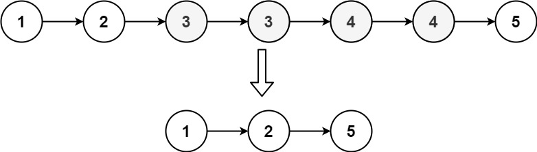
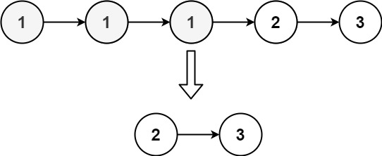

# 82. Remove Duplicates from Sorted List II <Badge type="warning" text="Medium" />

Given the `head` of a sorted linked list, *delete all nodes that have duplicate numbers, leaving only distinct numbers from the original list*. Return *the linked list **sorted** as well*.

> Example 1:  
Input: head = [1,2,3,3,4,4,5]   
Output: [1,2,5]



> Example 2:  
Input: head = [1,1,1,2,3]   
Output: [2,3]



## Approach

**Input:** A linked list `head`

**Output:** Delete all nodes that contain duplicate numbers, leaving only nodes with unique numbers

This problem belongs to the **Linked List Deletion** category.

This question requires deleting all nodes with duplicate numbers. To handle the case where the head node itself might be deleted, we use a dummy node `dummy` that points to the head of the linked list.

We use two pointers:
- `prev`: Points to the last node that we are sure will not be deleted.
- `curr`: Starts traversing the linked list from the head to check for duplicates.

### Detailed Steps
1. Initialization:
   * Create a dummy node `dummy`, and set `dummy.next = head`.
   * Define `prev = dummy` and `curr = head`.
2. Start traversing the linked list:
   * If `curr.val == curr.next.val`:
     * This means we encountered a duplicate node.
     * Record the duplicate value `dup_val = curr.val`.
     * Use a `while` loop to skip all nodes whose value equals `dup_val`, i.e., `curr = curr.next`.
     * Set `prev.next = curr` to skip this sequence of duplicate nodes.
   * Otherwise:
     * The current node is not a duplicate, move both `prev` and `curr` pointers to the next position.
3. Finally, return `dummy.next`, which is the head of the new linked list.

## Implementation

::: code-group

```python
class Solution:
    def deleteDuplicates(self, head: Optional[ListNode]) -> Optional[ListNode]:
        # Create a dummy node to facilitate handling cases where the head node is deleted
        dummy = ListNode(0)
        dummy.next = head

        prev = dummy  # Points to the last confirmed non-duplicate node
        curr = head   # The node currently being traversed

        while curr and curr.next:
            if curr.val == curr.next.val:
                # Record the duplicate value
                dup_val = curr.val
                # Skip all nodes with the duplicate value
                while curr and curr.val == dup_val:
                    curr = curr.next
                # prev directly points to the first non-duplicate node
                prev.next = curr
            else:
                # Not a duplicate, prev and curr move forward synchronously
                prev = curr
                curr = curr.next

        return dummy.next
```

```javascript
/**
 * @param {ListNode} head
 * @return {ListNode}
 */
var deleteDuplicates = function(head) {
    const dummy = new ListNode(null, head);

    let prev = dummy;
    let curr = head;

    while (curr && curr.next) {
        if (curr.val === curr.next.val) {
            const val = curr.val;
            while (curr && curr.val == val) {
                curr = curr.next;
            }
            prev.next = curr;
        } else {
            prev = curr;
            curr = curr.next;
        }
    }

    return dummy.next;
};  
```

:::

## Complexity Analysis

- Time Complexity: `O(n)`
- Space Complexity: `O(1)`

## Links

[82. Remove Duplicates from Sorted List II (English)](https://leetcode.com/problems/remove-duplicates-from-sorted-list-ii/)

[82. 删除排序链表中的重复元素 II (Chinese)](https://leetcode.cn/problems/remove-duplicates-from-sorted-list-ii/)
