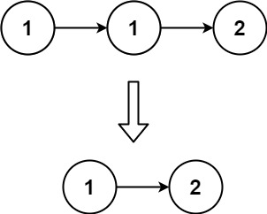
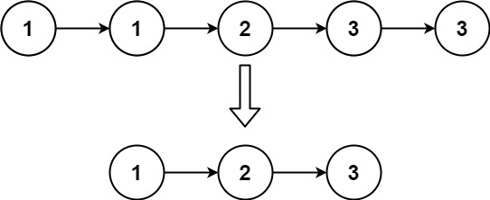

# 83. Remove Duplicates from Sorted List <Badge type="tip" text="Easy" />

Given the `head` of a sorted linked list, *delete all duplicates such that each element appears only once*. Return *the linked list **sorted** as well*.

> Example 1:  
Input: head = [1,1,2]  
Output: [1,2]



> Example 2:  
Input: head = [1,1,2,3,3]  
Output: [1,2,3]



## Approach

**Input:** A linked list `head`

**Output:** Delete duplicate elements in the linked list so that each duplicate element only retains one copy

This problem belongs to the **Linked List Deletion** category.

Since one copy of the duplicate elements will be retained, we can traverse directly starting from `head`.

Determine whether the value of the next node is the same as the value of the current node. If it is the same, skip the next node; otherwise, move to the next node.

## Implementation

::: code-group

```python
class Solution:
    def deleteDuplicates(self, head: Optional[ListNode]) -> Optional[ListNode]:
        curr = head  # The currently traversed node

        # As long as both the current node and the next node exist, continue traversing
        while curr and curr.next:
            if curr.val == curr.next.val:
                # If the current value equals the next value, skip the next node (delete the duplicate)
                curr.next = curr.next.next
            else:
                # If the values are not equal, move to the next node
                curr = curr.next

        return head  # Return the head node of the original linked list
```

```javascript
/**
 * @param {ListNode} head
 * @return {ListNode}
 */
var deleteDuplicates = function(head) {
    let curr = head;

    while (curr && curr.next) {
        if (curr.val === curr.next.val) {
            curr.next = curr.next.next;
        } else {
            curr = curr.next;
        }
    }
    
    return head;
};
```

:::

## Complexity Analysis

- Time Complexity: `O(n)`
- Space Complexity: `O(1)`

## Links

[83. Remove Duplicates from Sorted List (English)](https://leetcode.com/problems/remove-duplicates-from-sorted-list/)

[83. 删除排序链表中的重复元素 (Chinese)](https://leetcode.cn/problems/remove-duplicates-from-sorted-list/)
