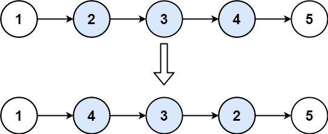

# 92. Reverse Linked List II <Badge type="warning" text="Medium" />

Given the `head` of a singly linked list and two integers `left` and `right` where `left <= right`, reverse the nodes of the list from position `left` to position `right`, and return *the reversed list*.



> Example 1:  
Input: head = [1,2,3,4,5], left = 2, right = 4   
Output: [1,4,3,2,5]

> Example 2:  
Input: head = [5], left = 1, right = 1   
Output: [5]

## Approach

**Input:** A linked list `head`, two integers `left` and `right`

**Output:** Reverse the nodes in the range `[left, right]` in the linked list, and return the reversed linked list

This problem belongs to the **Linked List Reversal** category.

`... p0 -> left ... -> right -> right + 1 ...` => `... p0 -> right ... -> left -> right + 1 ...`

First, we need to find the node immediately preceding the start of the reversal, `prev`.

Next, we reverse the nodes within `[left, right]`. We must record the last node before the reversal `reserve_pre`, and the node that comes immediately after the reversed portion.

After the reversal is complete, the traversed node `curr` should be at position `right + 1`. The node after `prev` becomes the last node of the reversed portion, so we need to point it to the node that originally followed the reversed portion: `prev.next.next = curr`.

Finally, we update `prev.next` to point to the new head of the reversed portion.

## Implementation

::: code-group

```python
class Solution:
    def reverseBetween(self, head: Optional[ListNode], left: int, right: int) -> Optional[ListNode]:
        # Create a dummy node to uniformly handle cases where the head node is reversed
        dummy = ListNode(0)
        dummy.next = head

        # Step 1: Find the node immediately before 'left' (the predecessor of the reversed section)
        prev = dummy
        for _ in range(left - 1):
            prev = prev.next  # Move to the node right before 'left'

        # Step 2: Start reversing the linked list nodes between 'left' and 'right'
        reverse_prev = None
        curr = prev.next  # Start reversing from the 'left'-th node

        for _ in range(right - left + 1):
            next_temp = curr.next
            curr.next = reverse_prev
            reverse_prev = curr
            curr = next_temp

        # Step 3: Reconnect the reversed section back into the linked list
        # prev.next points to the original 'left' node, which is now the tail of the reversed section
        # It should connect to the remainder of the list (curr)
        prev.next.next = curr
        # prev.next is updated to point to the new head of the reversed section (reverse_prev)
        prev.next = reverse_prev

        return dummy.next  # Return the actual head node
```

```javascript
/**
 * @param {ListNode} head
 * @param {number} left
 * @param {number} right
 * @return {ListNode}
 */
var reverseBetween = function(head, left, right) {
    const dummy = new ListNode(0, head);
    let p0 = dummy;

    for (let i = 0; i < left - 1; i++) {
        p0 = p0.next;
    }

    let prev = null;
    let curr = p0.next;

    for (let j = left; j < right + 1; j++) {
        const nxt = curr.next;
        curr.next = prev;
        prev = curr;
        curr = nxt;
    }

    p0.next.next = curr;
    p0.next = prev;

    return dummy.next;
};
```

:::

## Complexity Analysis

- Time Complexity: `O(n)`
- Space Complexity: `O(1)`

## Links

[92. Reverse Linked List II (English)](https://leetcode.com/problems/reverse-linked-list-ii/)

[92. 反转链表 II (Chinese)](https://leetcode.cn/problems/reverse-linked-list-ii/)
