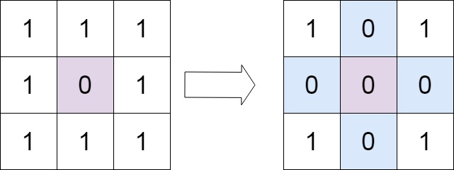
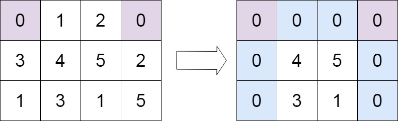

# 73. Set Matrix Zeroes <Badge type="warning" text="Medium" />

Given an `m x n` integer matrix `matrix`, if an element is `0`, set its entire row and column to `0`'s.

You must do it **in place**.



> Example 1:  
Input: matrix = [[1,1,1],[1,0,1],[1,1,1]]   
Output: [[1,0,1],[0,0,0],[1,0,1]]



> Example 2:  
Input: matrix = [[0,1,2,0],[3,4,5,2],[1,3,1,5]]   
Output: [[0,0,0,0],[0,4,5,0],[0,3,1,0]]

## Approach
**Input:** An `m x n` matrix

**Output:** If an element is `0`, set its entire row and column to `0`'s

This problem belongs to the **In-place Matrix Modification** category.

1. First, check independently whether the first row and first column need to be zeroed out.
  - Because the first row/column will be used as a marker area, we cannot let the original information be lost.

2. Scan the matrix (skipping the first row and first column).
  - If `matrix[i][j] == 0`:
    - Mark that the row needs to be zeroed at `matrix[i][0]`
    - Mark that the column needs to be zeroed at `matrix[0][j]`

3. Iterate through the matrix again (skipping the first row and first column).
  - If the row or the column is marked as `0`, set `matrix[i][j]` to `0`.

4. Finally, process the first row and first column.
  - Based on the booleans recorded in the first step, zero out the entire first row/column if necessary.

**Summary in one sentence:**   
Use the first row and first column as a "marker array" to avoid using extra space, thereby postponing the zeroing operations to be processed uniformly at the end.

## Implementation

::: code-group

```python
from typing import List

class Solution:
    def setZeroes(self, matrix: List[List[int]]) -> None:
        """
        Do not return anything, modify matrix in-place instead.
        """
        m, n = len(matrix), len(matrix[0])

        # Check if the first row needs to be zeroed out
        rowZero = any(matrix[0][i] == 0 for i in range(n))
        # Check if the first column needs to be zeroed out
        colZero = any(matrix[j][0] == 0 for j in range(m))

        # Iterate through elements excluding the first row and first column
        # If an element is 0, set the first element of that row and the first element of that column to 0
        # This is equivalent to using the first row and first column as a marker area
        for i in range(1, m):
            for j in range(1, n):
                if matrix[i][j] == 0:
                    matrix[i][0] = 0
                    matrix[0][j] = 0
        
        # Iterate through the matrix again (excluding the first row and first column)
        # If the row or column is 0 in the marker area, set the current element to 0
        for i in range(1, m):
            for j in range(1, n):
                if matrix[i][0] == 0 or matrix[0][j] == 0:
                    matrix[i][j] = 0
        
        # If the first row needed to be zeroed initially, set the entire row to 0
        if rowZero:
            for i in range(n):
                matrix[0][i] = 0
        
        # If the first column needed to be zeroed initially, set the entire column to 0
        if colZero:
            for j in range(m):
                matrix[j][0] = 0
```

```javascript
/**
 * @param {number[][]} matrix
 * @return {void} Do not return anything, modify matrix in-place instead.
 */
var setZeroes = function(matrix) {
    const m = matrix.length;       // Number of rows in the matrix
    const n = matrix[0].length;    // Number of columns in the matrix

    // Check if there is a 0 in the first row
    const row0Zero = matrix[0].some(item => item === 0);
    // Check if there is a 0 in the first column
    const col0Zero = matrix.some(item => item[0] === 0);

    // 1. Traverse the area excluding the first row and first column
    //    If matrix[i][j] == 0, mark the first element of that row and the first element of that column
    for (let i = 1; i < m; i++) {
        for (let j = 1; j < n; j++) {
            if (matrix[i][j] === 0) {
                matrix[i][0] = 0;   // Mark the i-th row to be zeroed
                matrix[0][j] = 0;   // Mark the j-th column to be zeroed
            }
        }
    }

    // 2. Traverse the area excluding the first row and first column again
    //    Decide whether to zero out based on the marker area (first row, first column)
    for (let i = 1; i < m; i++) {
        for (let j = 1; j < n; j++) {
            if (matrix[i][0] === 0 || matrix[0][j] === 0) {
               matrix[i][j] = 0;   // If the row or column is marked as 0, the element is zeroed
            }
        }
    }

    // 3. If the first row needed to be zeroed initially, set the entire row to 0
    if (row0Zero) {
        for (let i = 0; i < n; i++) {
            matrix[0][i] = 0;
        }
    }

    // 4. If the first column needed to be zeroed initially, set the entire column to 0
    if (col0Zero) {
        for (let i = 0; i < m; i++) {
            matrix[i][0] = 0;
        }
    }
};
```

:::


## Complexity Analysis

- Time Complexity: `O(m * n)`
- Space Complexity: `O(1)`

## Links

[73. Set Matrix Zeroes (English)](https://leetcode.com/problems/set-matrix-zeroes/description/)

[73. 矩阵置零 (Chinese)](https://leetcode.cn/problems/set-matrix-zeroes/description/)
