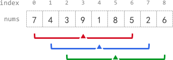

# 2090. K Radius Subarray Averages <Badge type="warning" text="Medium" />

You are given a **0-indexed** array `nums` of `n` integers, and an integer `k`.

The **k-radius average** for a subarray of `nums` centered at some index `i` with the **radius** `k` is the average of **all** elements in `nums` between the indices `i - k` and `i + k` (**inclusive**). If there are less than `k` elements before or after the index `i`, then the **k-radius average** is `-1`.

Build and return *an array* `avgs` *of length* `n` *where* `avgs[i]` *is the **k-radius average** for the subarray centered at index* `i`.

The **average** of `x` elements is the sum of the `x` elements divided by `x`, using **integer division**. The integer division truncates toward zero, which means losing its fractional part.

For example, the average of four elements `2`, `3`, `1`, and `5` is `(2 + 3 + 1 + 5) / 4 = 11 / 4 = 2.75`, which truncates to `2`.



> Example 1:  
Input: nums = [7,4,3,9,1,8,5,2,6], k = 3 
Output: [-1,-1,-1,5,4,4,-1,-1,-1]   
Explanation:   
avg[0], avg[1], and avg[2] are -1 because there are less than k elements before each index.  
The sum of the subarray centered at index 3 with radius 3 is: 7 + 4 + 3 + 9 + 1 + 8 + 5 = 37. Using integer division, avg[3] = 37 / 7 = 5.  
For the subarray centered at index 4, avg[4] = (4 + 3 + 9 + 1 + 8 + 5 + 2) / 7 = 4.  
For the subarray centered at index 5, avg[5] = (3 + 9 + 1 + 8 + 5 + 2 + 6) / 7 = 4.  
avg[6], avg[7], and avg[8] are -1 because there are less than k elements after each index.

> Example 2:  
Input: nums = [100000], k = 0   
Output: [100000]   
Explanation:   
The sum of the subarray centered at index 0 with radius 0 is: 100000.  
avg[0] = 100000 / 1 = 100000.

> Example 3:  
Input: nums = [8], k = 100000   
Output: [-1]   
Explanation:   
avg[0] is -1 because there are less than k elements before and after index 0.

## Approach

**Input:** An integer array `nums` and an integer `k`.

**Output:** Return an array populated with the k-radius averages centered at index `i`.

This problem uses the **Fixed-length Sliding Window** technique.

- The length of the sliding window is `2 * k + 1`.
- If the window string length evaluates to 0 (i.e., `k=0`), straightly return the baseline array.
- If the window frame overlaps array limits naturally, just return populated sequence initialized comprehensively using `[-1] * len(nums)`.
- Mathematically we only have active evaluations valid located uniquely between sequence bounds indexed at `[k, n - k]`.

## Implementation

::: code-group

```python
from typing import List

class Solution:
    def getAverages(self, nums: List[int], k: int) -> List[int]:
        # Formulate mapping structure populated cleanly carrying placeholder evaluation markers uniformly initially
        n = len(nums)
        result = [-1] * n
        
        # Immediate mapping returning source when parameters natively stipulate null radius properties directly mapped over
        if k == 0:
            return nums
        
        # Established window dimension bounding values natively encompassing radius bounds symmetrically
        window_size = 2 * k + 1
        
        # When properties stipulate dimensions eclipsing structural array limits natively, baseline values stand globally 
        if window_size > n:
            return result
        
        # Capture inaugural segment calculations targeting exact parameters satisfying bounding logic  
        window_sum = sum(nums[:window_size])
        
        # Translate baseline evaluations mathematically dropping float properties safely 
        result[k] = window_sum // window_size
        
        # Migrate evaluations iterating across remainder of active boundaries linearly 
        for i in range(k + 1, n - k):
            # Trim leading outlier values logically, append successive incoming tail bounds updating pool dynamically  
            window_sum = window_sum - nums[i - k - 1] + nums[i + k]
            result[i] = window_sum // window_size
        
        return result
```

```javascript
/**
 * @param {number[]} nums
 * @param {number} k
 * @return {number[]}
 */
var getAverages = function(nums, k) {
    if (k == 0) return nums;

    const windowSize = 2 * k + 1;
    const ans = new Array(nums.length).fill(-1);
    
    if (windowSize > nums.length) {
        return ans;
    }

    let windowSum = 0;

    for (let i = 0; i < windowSize; i++) {
        windowSum += nums[i];
    }
    
    ans[k] = Math.floor(windowSum / windowSize);

    for (let i = k + 1; i < nums.length - k; i++) {
        windowSum = windowSum - nums[i - k - 1] + nums[i + k];
        ans[i] = Math.floor(windowSum / windowSize);
    }

    return ans;
};
```

:::

## Complexity Analysis

- Time Complexity: O(n)
- Space Complexity: O(n) for the output array

## Links

[2090. K Radius Subarray Averages (English)](https://leetcode.com/problems/k-radius-subarray-averages/description/)
[2090. 半径为 k 的子数组平均值 (Chinese)](https://leetcode.cn/problems/k-radius-subarray-averages/description/)
