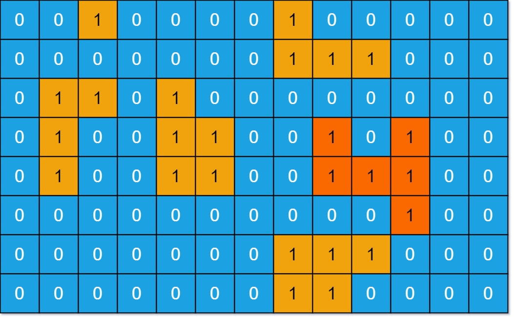

# 695. 岛屿的最大面积 <Badge type="warning" text="Medium" />

给你一个大小为 `m x n` 的二进制矩阵 `grid` 。

岛屿 是由一些相邻的 1 (代表土地) 构成的组合，这里的「相邻」要求两个 1 必须在 水平或者竖直的四个方向上 相邻。你可以假设 `grid` 的四个边缘都被 0（代表水）包围着。

岛屿的面积是岛上值为 1 的单元格的数目。

计算并返回 `grid` 中最大的岛屿面积。如果没有岛屿，则返回面积为 0 。



>示例 1:  
输入：grid = [   
    [0,0,1,0,0,0,0,1,0,0,0,0,0],   
    [0,0,0,0,0,0,0,1,1,1,0,0,0],   
    [0,1,1,0,1,0,0,0,0,0,0,0,0],   
    [0,1,0,0,1,1,0,0,1,0,1,0,0],   
    [0,1,0,0,1,1,0,0,1,1,1,0,0],   
    [0,0,0,0,0,0,0,0,0,0,1,0,0],   
    [0,0,0,0,0,0,0,1,1,1,0,0,0],   
    [0,0,0,0,0,0,0,1,1,0,0,0,0]   
]   
输出：6   
解释：答案不应该是 11 ，因为岛屿只能包含水平或垂直这四个方向上的 1 。  

>示例 2:  
输入：grid = [[0,0,0,0,0,0,0,0]]   
输出：0   

## 解题思路
**输入：** 一个由 `1`（陆地）和 `0`（水）组成的的二维网格

**输出：** 计算岛屿的最大面积

本题属于**网格图 DFS 类**问题。

这道题和 [200.岛屿数量](./200.md) 解法类似

我们依然是通过 `dfs` 遍历将一块陆地的边界探索出来，当我们探索到边界外的时候岛屿面积应该是 0 所以要返回 0

其他情况都要将上下左右的面积累加起来并且加上自身的面积 1 `dfs(r + 1, c) + dfs(r - 1, c) + dfs(r, c + 1) + dfs(r, c - 1) + 1`


## 代码实现

::: code-group

```python
class Solution:
    def maxAreaOfIsland(self, grid: List[List[int]]) -> int:
        rows, cols = len(grid), len(grid[0])  # 获取网格的行列数

        # 定义 DFS 函数：用于计算从 (r, c) 出发的岛屿面积
        def dfs(r, c):
            # 如果越界，或者当前不是陆地（值为 0），直接返回面积 0
            if r < 0 or r >= rows or c < 0 or c >= cols or grid[r][c] == 0:
                return 0

            grid[r][c] = 0  # 将当前格子标记为已访问（淹掉陆地）

            # 向四个方向扩展，累加相邻陆地的面积
            area = 1
            area += dfs(r + 1, c)  # 向下
            area += dfs(r - 1, c)  # 向上
            area += dfs(r, c + 1)  # 向右
            area += dfs(r, c - 1)  # 向左

            return area

        maxArea = 0  # 用于记录最大的岛屿面积

        # 遍历整个网格
        for r in range(rows):
            for c in range(cols):
                if grid[r][c] == 1:  # 如果是陆地
                    # 计算当前岛屿的面积，并尝试更新最大值
                    maxArea = max(maxArea, dfs(r, c))

        return maxArea
```

```javascript
/**
 * @param {number[][]} grid
 * @return {number}
 */
var maxAreaOfIsland = function(grid) {
    const rows = grid.length;
    const cols = grid[0].length;

    function dfs(r, c) {
        if (r < 0 || r >= rows || c < 0 || c >= cols || grid[r][c] == 0) {
            return 0;
        }

        grid[r][c] = 0;

        let area = 0;

        area += dfs(r + 1, c);
        area += dfs(r - 1, c);
        area += dfs(r, c + 1);
        area += dfs(r, c - 1);

        return area + 1;
    }

    let maxArea = 0;
    for (let r = 0; r < rows; r++) {
        for (let c = 0; c < cols; c++) {
            maxArea = Math.max(maxArea, dfs(r, c));
        }
    }

    return maxArea;
};
```

:::

## 复杂度分析

时间复杂度：O(m * n)

空间复杂度：O(m * n)

## 链接

[695 国际版](https://leetcode.com/problems/max-area-of-island/description/)

[695 中文版](https://leetcode.cn/problems/max-area-of-island/description/)

