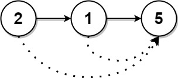
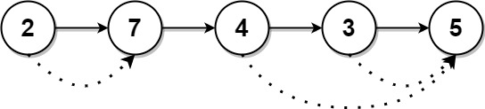

# 1019. 链表中的下一个更大节点 <Badge type="warning" text="Medium" />

给定一个长度为 `n` 的链表 `head`

对于列表中的每个节点，查找下一个 更大节点 的值。也就是说，对于每个节点，找到它旁边的第一个节点的值，这个节点的值 严格大于 它的值。

返回一个整数数组 `answer` ，其中 `answer[i]` 是第 i 个节点( 从1开始 )的下一个更大的节点的值。如果第 `i` 个节点没有下一个更大的节点，设置 `answer[i] = 0` 。


>示例 1:  
输入：head = [2,1,5]   
输出：[5,5,0]



>示例 2:  
输入：head = [2,7,4,3,5]   
输出：[7,0,5,5,0]



## 解题思路
**输入：** 一个链表 `head`

**输出：** 返回一个数组表示第 `i` 个节点遇到的下一个更大的值，没有则设置为 0

本题属于**链表 + 单调栈**问题。

我们可以把这道题转化成单调栈问题

- 我们先遍历链表将所有的值都存到数组中
- 利用一个栈保存之前没有找到更大的值的元素下标
- 每当遍历到下一个元素时都和栈中的最后一个元素下标对应的值比较大小
- 直到栈中的元素都比当前值大或者栈被清空为止，栈内只会保存还没找到下一个更大的值的元素下标，这个就是单调栈
- 每当栈中下标对应的值比当前元素小则直接更改 `answer[i] = val`

## 代码实现

::: code-group

```python
class Solution:
    def nextLargerNodes(self, head: Optional[ListNode]) -> List[int]:
        # Step 1：先将链表转成数组，方便通过索引访问
        values = []
        curr = head
        while curr:
            values.append(curr.val)
            curr = curr.next

        # Step 2：初始化结果数组，默认都是 0（表示没有更大值）
        res = [0] * len(values)
        stack = []  # 单调栈，栈中存储的是索引，而不是值

        # Step 3：遍历数组，用单调栈求“下一个更大的值”
        for i, val in enumerate(values):
            # 如果当前值比栈顶索引对应的值大，说明找到了更大值
            while stack and values[stack[-1]] < val:
                idx = stack.pop()     # 弹出栈顶索引
                res[idx] = val        # 当前值就是它的“下一个更大值”

            # 当前索引入栈，等待后面更大的元素来更新它
            stack.append(i)

        return res
```

```javascript
/**
 * @param {ListNode} head
 * @return {number[]}
 */
var nextLargerNodes = function(head) {
    let curr = head;
    const values = [];
    while (curr) {
        values.push(curr.val);
        curr = curr.next;
    }

    const ans = new Array(values.length).fill(0);
    const stack = [];

    values.forEach((item, index) => {
        while (stack.length && values[stack[stack.length - 1]] < item) {
            const idx = stack.pop();
            ans[idx] = item;
        }

        stack.push(index);
    });

    return ans;
};
```

:::

## 复杂度分析

时间复杂度：O(n)

空间复杂度：O(n)

## 链接

[1019 国际版](https://leetcode.com/problems/next-greater-node-in-linked-list/)

[1019 中文版](https://leetcode.cn/problems/next-greater-node-in-linked-list/)
