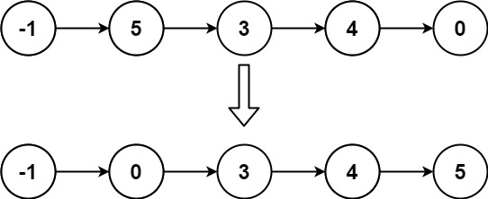

# 147. 对链表进行插入排序 <Badge type="warning" text="Medium" />

给定单个链表的头 head ，使用 插入排序 对链表进行排序，并返回 排序后链表的头 。

插入排序 算法的步骤:

1. 插入排序是迭代的，每次只移动一个元素，直到所有元素可以形成一个有序的输出列表。
2. 每次迭代中，插入排序只从输入数据中移除一个待排序的元素，找到它在序列中适当的位置，并将其插入。
3. 重复直到所有输入数据插入完为止。

下面是插入排序算法的一个图形示例。部分排序的列表(黑色)最初只包含列表中的第一个元素。每次迭代时，从输入数据中删除一个元素(红色)，并就地插入已排序的列表中。

对链表进行插入排序。


>示例 1:  
输入: head = [4,2,1,3]    
输出: [1,2,3,4]


>示例 2:  
输入: head = [-1,5,3,4,0]    
输出: [-1,0,3,4,5]



## 解题思路
**输入：** 一个链表 `head`

**输出：** 对链表进行插入排序操作并返回最终排序后的表头

本题属于**链表插入与重排类**问题。

我们需要用到一个 `dummy` 节点，在每次对一个元素排好序之后都会指向最新数组的头节点

我们在排序过程中需要记录当前节点的下一个节点 `currNext = curr.next`

每次都从 `dummy` 节点开始遍历，记录为 `prev`，直到找到 `prev.next` 比 `curr.val` 要大的节点就停下来将当前节点插入该位置中 `prev -> curr -> prev.next`

之后继续从 `currNext` 开始遍历

最后返回 `dummy.next`

## 代码实现

::: code-group

```python
class Solution:
    def insertionSortList(self, head: Optional[ListNode]) -> Optional[ListNode]:
        # 创建一个哑节点 dummy，方便后续统一插入逻辑
        dummy = ListNode(0)

        # curr 表示当前需要插入排序链表的节点
        curr = head

        # 遍历原链表
        while curr:
            # 保存当前节点的下一个节点，以便下一轮处理
            currNext = curr.next

            # 从 dummy 开始寻找合适的插入位置（prev 是 curr 的前驱）
            prev = dummy
            while prev.next and prev.next.val < curr.val:
                prev = prev.next  # 向后移动，直到找到第一个大于等于 curr 的位置

            # 完成插入：
            # 先保存 prev 原来的 next
            prevNext = prev.next

            # 把 curr 插到 prev 和 prevNext 之间
            prev.next = curr
            curr.next = prevNext

            # 继续处理原链表中的下一个节点
            curr = currNext

        # 返回排好序的链表头节点（dummy.next）
        return dummy.next
```

```javascript
var insertionSortList = function(head) {
    const dummy = new ListNode();

    let curr = head;
    while (curr != null) {
        let prev = dummy;
        const currNext = curr.next;

        while (prev.next && prev.next.val < curr.val) {
            prev = prev.next
        }

        prevNext = prev.next;
        prev.next = curr;
        curr.next = prevNext;
        curr = currNext;
    }

    return dummy.next;
};
```

:::

## 复杂度分析

时间复杂度：O(n ^ 2)

空间复杂度：O(1)

## 链接

[147 国际版](https://leetcode.com/problems/insertion-sort-list/description/)

[147 中文版](https://leetcode.cn/problems/insertion-sort-list/description/)
