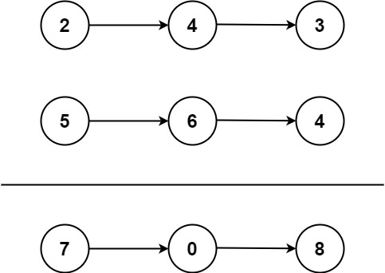

# 2. 两数相加 <Badge type="warning" text="Medium" />

给你两个 非空 的链表，表示两个非负的整数。它们每位数字都是按照 逆序 的方式存储的，并且每个节点只能存储 一位 数字。

请你将两个数相加，并以相同形式返回一个表示和的链表。

你可以假设除了数字 0 之外，这两个数都不会以 0 开头。



>示例 1:  
输入：l1 = [2,4,3], l2 = [5,6,4]  
输出：[7,0,8]   
解释：342 + 465 = 807.

>示例 2:  
输入：l1 = [0], l2 = [0]   
输出：[0]

>示例 2:  
输入：l1 = [9,9,9,9,9,9,9], l2 = [9,9,9,9]   
输出：[8,9,9,9,0,0,0,1]

## 解题思路
**输入：** 两个链表 `l1` `l2`，每个节点只能存储一个数字

**输出：** 返回一个新的链表，表示它们的和

本题属于**合并链表类**问题。

- 我们需要有一个变量 `carry` 来存储相加后进位的值，因为最大数字只有 9，所以 `carry` 只会是 0 和 1
- 创建一个虚拟头节点 `dummy`：它的 `.next` 指向最终的答案链表
- 遍历两个链表 `l1`、`l2`，直到都为空且进位 `carry` 也为 0：`while l1 or l2 or carry:`
- 分别取出当前位的值 `val1`, `val2`
- 计算总和：`total = val1 + val2 + carry`
- 当前节点值为：`nodeVal = total % 10`
- 更新进位值：`carry = total // 10`
- 将当前位结果插入结果链表: `curr.next = ListNode(nodeVal)`

最后返回 `dummy.next` 即为结果链表头。

## 代码实现

::: code-group

```python
class Solution:
    def addTwoNumbers(self, l1: Optional[ListNode], l2: Optional[ListNode]) -> Optional[ListNode]:
        # 创建一个虚拟头节点，方便后续操作
        dummy = ListNode(0)
        curr = dummy  # 指针用于构建结果链表
        carry = 0     # 进位缓存

        # 遍历两个链表，直到两个都为空且没有进位
        while l1 or l2 or carry:
            # 分别取出两个节点的值，如果为空则视为 0
            val1 = l1.val if l1 else 0
            val2 = l2.val if l2 else 0

            # 两个值加上进位
            total = val1 + val2 + carry
            carry = total // 10     # 更新进位（0 或 1）
            node_val = total % 10   # 当前位的值

            # 构建新节点，加入结果链表
            curr.next = ListNode(node_val)
            curr = curr.next  # 指针后移

            # 移动两个输入链表的指针
            if l1:
                l1 = l1.next
            if l2:
                l2 = l2.next

        # 返回虚拟头节点的下一个，即结果链表的头
        return dummy.next
```

```javascript
var addTwoNumbers = function(l1, l2) {
    const dummy = new ListNode(0);
    let curr = dummy;
    let carry = 0;

    while (l1 || l2 || carry) {
        const val1 = l1 ? l1.val : 0;
        const val2 = l2 ? l2.val : 0;

        const total = val1 + val2 + carry;
        const nodeVal = total % 10;
        carry = Math.floor(total / 10);

        curr.next = new ListNode(nodeVal);
        curr = curr.next;

        if (l1) {
            l1 = l1.next;
        }

        if (l2) {
            l2 = l2.next;
        }
    }

    return dummy.next;
};
```

:::

## 复杂度分析

时间复杂度：O(n)

空间复杂度：O(1)

## 链接

[2 国际版](https://leetcode.com/problems/add-two-numbers/description/)

[2 中文版](https://leetcode.cn/problems/add-two-numbers/description/)

