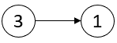
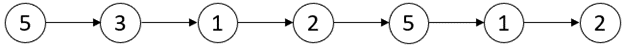
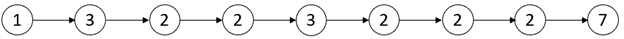
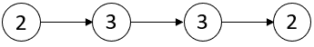

# 2058. 找出临界点之间的最小和最大距离 <Badge type="warning" text="Medium" />

链表中的 临界点 定义为一个 局部极大值点 或 局部极小值点 。

如果当前节点的值 严格大于 前一个节点和后一个节点，那么这个节点就是一个  局部极大值点 。

如果当前节点的值 严格小于 前一个节点和后一个节点，那么这个节点就是一个  局部极小值点 。

注意：节点只有在同时存在前一个节点和后一个节点的情况下，才能成为一个 局部极大值点 / 极小值点 。

给你一个链表 `head` ，返回一个长度为 2 的数组 `[minDistance, maxDistance]` ，其中 `minDistance` 是任意两个不同临界点之间的最小距离，`maxDistance` 是任意两个不同临界点之间的最大距离。如果临界点少于两个，则返回 `[-1，-1]` 。。


>示例 1:  
输入：head = [3,1]   
输出：[-1,-1]   
解释：链表 [3,1] 中不存在临界点。



>示例 2:  
输入：head = [5,3,1,2,5,1,2]   
输出：[1,3].  
解释：存在三个临界点：   
[5,3,1,2,5,1,2]：第三个节点是一个局部极小值点，因为 1 比 3 和 2 小。   
[5,3,1,2,5,1,2]：第五个节点是一个局部极大值点，因为 5 比 2 和 1 大。   
[5,3,1,2,5,1,2]：第六个节点是一个局部极小值点，因为 1 比 5 和 2 小。   
第五个节点和第六个节点之间距离最小。minDistance = 6 - 5 = 1 。   
第三个节点和第六个节点之间距离最大。maxDistance = 6 - 3 = 3 。



>示例 3:  
输入：head = [1,3,2,2,3,2,2,2,7]   
输出：[3,3]   
解释：存在两个临界点：   
[1,3,2,2,3,2,2,2,7]：第二个节点是一个局部极大值点，因为 3 比 1 和 2 大。   
[1,3,2,2,3,2,2,2,7]：第五个节点是一个局部极大值点，因为 3 比 2 和 2 大。   
最小和最大距离都存在于第二个节点和第五个节点之间。   
因此，minDistance 和 maxDistance 是 5 - 2 = 3 。   
注意，最后一个节点不算一个局部极大值点，因为它之后就没有节点了。



>示例 4:  
输入：head = [2,3,3,2]    
输出：[-1,-1]   
解释：链表 [2,3,3,2] 中不存在临界点。



## 解题思路
**输入：** 一个包含整数的链表 `head`

**输出：** 返回临界值的最短距离和最长距离

本题属于**链表遍历类**问题。

我们可以用一个数组 `critical_points` 将所有临界值的下标都存储起来 

当发现临界值数量只有一个时候就没有相对距离，直接返回 `[-1, -1]`

最短距离我们可以遍历整个 `critical_points` 比较每个相邻的临界值距离取最小的值

最长距离我们直接将最后一个临界值下标减去第一个临界值下标即可

## 代码实现

::: code-group

```python
class Solution:
    def nodesBetweenCriticalPoints(self, head: Optional[ListNode]) -> List[int]:
        # 当前位置索引，从第2个节点开始检查（第1个节点无法作为临界点）
        pos = 1

        # prev 表示前一个节点，curr 表示当前节点
        prev = head
        curr = head.next

        # 记录所有临界点的位置
        critical_points = []

        # 遍历链表，直到倒数第一个节点（curr.next 要存在）
        while curr and curr.next:
            # 判断 curr 是否是一个“临界点”
            if (curr.val > prev.val and curr.val > curr.next.val) or \
               (curr.val < prev.val and curr.val < curr.next.val):
                critical_points.append(pos)

            # 移动指针，继续遍历
            prev = curr
            curr = curr.next
            pos += 1

        # 如果临界点不足两个，返回 [-1, -1]
        if len(critical_points) < 2:
            return [-1, -1]

        # 最小间距初始化为正无穷
        min_distance = float('inf')
        # 最大间距：第一个临界点和最后一个临界点之间的距离
        max_distance = critical_points[-1] - critical_points[0]

        # 遍历相邻临界点，找出最小距离
        for i in range(1, len(critical_points)):
            min_distance = min(min_distance, critical_points[i] - critical_points[i - 1])

        return [min_distance, max_distance]
```

```javascript
/**
 * Definition for singly-linked list.
 * function ListNode(val, next) {
 *     this.val = (val===undefined ? 0 : val)
 *     this.next = (next===undefined ? null : next)
 * }
 */
/**
 * @param {ListNode} head
 * @return {number[]}
 */
var nodesBetweenCriticalPoints = function(head) {
    const points = [];

    let pos = 1;
    let prev = head;
    let curr = head.next;

    while (curr.next) {
        if ((curr.val > prev.val && curr.val > curr.next.val) || (curr.val < prev.val && curr.val < curr.next.val)) {
            points.push(pos);
        }

        prev = curr;
        curr = curr.next;
        pos++;
    }

    if (points.length < 2) return [-1, -1];

    let minDistance = Infinity;
    for (let i = 1; i < points.length; i++) {
        minDistance = Math.min(minDistance, points[i] - points[i - 1]);
    }

    const maxDistance = points.at(-1) - points[0];

    return [minDistance, maxDistance];
};
```

:::

## 复杂度分析

时间复杂度：`O(n)`

空间复杂度：`O(k)`, `k < n`, 也可以用变量记录第一个临界值位置和最近一次的临界值位置将复杂度优化到 `O(1)`

## 链接

[2058 国际版](https://leetcode.com/problems/find-the-minimum-and-maximum-number-of-nodes-between-critical-points/description/)

[2058 中文版](https://leetcode.cn/problems/find-the-minimum-and-maximum-number-of-nodes-between-critical-points/description/)
