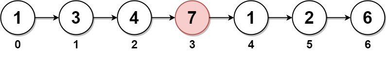

# 2095. 删除链表的中间节点 <Badge type="warning" text="Medium" />

给你一个链表的头节点 `head` 。删除 链表的 中间节点 ，并返回修改后的链表的头节点 `head` 。

长度为 n 链表的中间节点是从头数起第 `⌊n / 2⌋` 个节点（下标从 0 开始），其中 ⌊x⌋ 表示小于或等于 x 的最大整数。

对于 n = 1、2、3、4 和 5 的情况，中间节点的下标分别是 0、1、1、2 和 2 。

>示例 1:  
输入：head = [1,3,4,7,1,2,6]   
输出：[1,3,4,1,2,6]   
解释：   
上图表示给出的链表。节点的下标分别标注在每个节点的下方。   
由于 n = 7 ，值为 7 的节点 3 是中间节点，用红色标注。   
返回结果为移除节点后的新链表。    



>示例 2:  
输入：head = [1,2,3,4]   
输出：[1,2,4]   
解释：   
上图表示给出的链表。   
对于 n = 4 ，值为 3 的节点 2 是中间节点，用红色标注。


>示例 3:  
输入：head = [2,1]   
输出：[2]   
解释：   
上图表示给出的链表。   
对于 n = 2 ，值为 1 的节点 1 是中间节点，用红色标注。   
值为 2 的节点 0 是移除节点 1 后剩下的唯一一个节点。


## 解题思路
**输入：** 一个包含整数的链表 `head`

**输出：** 删除链表的中间节点并返回链表头

本题属于**快慢指针类**问题。

我们可以用快慢指针快速找到中间节点，注意这里要删除中间节点

所以慢指针要找到中间节点的上一个节点所以要从虚拟节点开始，快指针要从头节点开始

删除后返回虚拟节点的下一个节点

## 代码实现

::: code-group

```python
class Solution:
    def deleteMiddle(self, head: Optional[ListNode]) -> Optional[ListNode]:
        # 创建一个哑节点 dummy，指向链表头部，以便处理删除头节点的情况
        dummy = ListNode(next=head)
        
        # 初始化快慢指针，slow 指向 dummy，fast 指向 head
        slow, fast = dummy, head

        # 使用快慢指针遍历链表，fast 每次走两步，slow 每次走一步
        # 这样当 fast 到达链表末尾时，slow 刚好到达链表的中间节点前
        while fast and fast.next:
            slow = slow.next
            fast = fast.next.next
        
        # 删除中间节点，即将 slow 的 next 指向它的 next 的 next，跳过中间节点
        slow.next = slow.next.next
        
        # 返回删除中间节点后的链表，dummy.next 仍然指向头节点（除非中间节点是头节点）
        return dummy.next
```

```javascript
var deleteMiddle = function(head) {
    // 边界情况：如果链表只有一个节点，删除后返回 null
    if (!head.next) return null;

    // 创建哑节点 dummy，指向 head，方便统一操作
    const dummy = new ListNode(null, head);

    // 慢指针 slow 从 dummy 开始
    // 快指针 fast 从 head 开始
    let slow = dummy;
    let fast = head;

    // 快指针一次走两步，慢指针一次走一步
    // 当快指针到达末尾时，慢指针正好在中间节点的前一个位置
    while (fast && fast.next) {
        fast = fast.next.next;
        slow = slow.next;
    }

    // 删除中间节点：跳过 slow.next
    slow.next = slow.next.next;

    // 返回真正的头结点
    return dummy.next;
};
```

:::

## 复杂度分析

时间复杂度：`O(n)`

空间复杂度：`O(1)`

## 链接

[2095 国际版](https://leetcode.com/problems/delete-the-middle-node-of-a-linked-list/description/)

[2095 中文版](https://leetcode.cn/problems/delete-the-middle-node-of-a-linked-list/description/)
