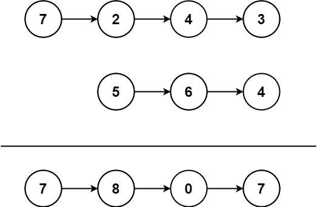

# 445. 两数相加 II <Badge type="warning" text="Medium" />

给你两个 非空 链表来代表两个非负整数。数字最高位位于链表开始位置。它们的每个节点只存储一位数字。将这两数相加会返回一个新的链表。

你可以假设除了数字 0 之外，这两个数字都不会以零开头。



>示例 1:  
输入：l1 = [7,2,4,3], l2 = [5,6,4]   
输出：[7,8,0,7]

>示例 2:  
输入：l1 = [2,4,3], l2 = [5,6,4]   
输出：[8,0,7]

>示例 3:  
输入：l1 = [0], l2 = [0]   
输出：[0]

## 解题思路
**输入：** 两个链表 `l1` `l2`

**输出：** 将两个链表合并起来，要从表尾开始相加

本题属于**合并链表类**问题。

由于题目不能反转链表，我们又需要从低位开始加，所以可以使用栈来模拟链表的反向访问。

- 初始化两个栈，分别存储 `l1` 和 `l2` 的所有节点值（从头到尾压入）。
- 从两个栈中依次弹出元素相加，同时处理进位 `carry`。
- 每次相加生成一个新节点，并采用头插法构造最终的结果链表。
- 循环结束后如果 `carry` 非零，还需要额外创建一个节点。

## 代码实现

::: code-group

```python
class Solution:
    def addTwoNumbers(self, l1: Optional[ListNode], l2: Optional[ListNode]) -> Optional[ListNode]:
        stack1, stack2 = [], []

        # 将 l1 所有节点值压入 stack1
        while l1:
            stack1.append(l1.val)
            l1 = l1.next

        # 将 l2 所有节点值压入 stack2
        while l2:
            stack2.append(l2.val)
            l2 = l2.next

        carry = 0  # 进位
        head = None  # 结果链表头指针

        # 模拟从最低位向最高位加法（从栈顶取值）
        while stack1 or stack2 or carry:
            val1 = stack1.pop() if stack1 else 0
            val2 = stack2.pop() if stack2 else 0

            total = val1 + val2 + carry
            carry = total // 10  # 更新进位
            node_val = total % 10

            # 创建当前节点，将其插入链表头部
            new_node = ListNode(node_val)
            new_node.next = head
            head = new_node

        return head  # 返回最终结果链表的头节点
```

```javascript
/**
 * @param {ListNode} l1
 * @param {ListNode} l2
 * @return {ListNode}
 */
var addTwoNumbers = function(l1, l2) {
    const st1 = [];
    const st2 = [];

    while (l1) {
        st1.push(l1.val);
        l1 = l1.next;
    }

    while (l2) {
        st2.push(l2.val);
        l2 = l2.next;
    }

    let carry = 0;
    let head = null;
    while (st1.length || st2.length || carry) {
        const val1 = st1.length ? st1.pop() : 0;
        const val2 = st2.length ? st2.pop() : 0;

        const total = val1 + val2 + carry;
        carry = Math.floor(total / 10);

        let curr = new ListNode(total % 10);
        curr.next = head;
        head = curr;
    }

    return head;
};
```

:::

## 复杂度分析

时间复杂度：O(n)

空间复杂度：O(n)

## 链接

[445 国际版](https://leetcode.com/problems/add-two-numbers-ii/description/)

[445 中文版](https://leetcode.cn/problems/add-two-numbers-ii/description/)
