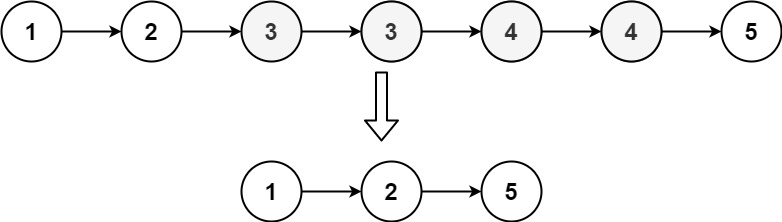
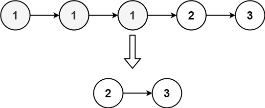

# 82. 删除排序链表中的重复元素 II <Badge type="warning" text="Medium" />

给定一个已排序的链表的头 `head` ， 删除原始链表中所有重复数字的节点，只留下不同的数字 。返回 已排序的链表 。

>示例 1:  
输入：head = [1,2,3,3,4,4,5]   
输出：[1,2,5]



>示例 2:  
输入：head = [1,1,1,2,3]   
输出：[2,3]



## 解题思路
**输入：** 一个链表 `head`

**输出：** 删除表中重复数字的节点，只留下没有重复过的节点

本题属于**链表删除勒**问题。

这题需要删除所有重复数字的节点，为了处理头节点也可能被删除的情况，使用一个 哑节点 `dummy`，它指向链表头部

我们用两个指针：
- `prev`：指向最后一个确认不会被删除的节点
- `curr`：从头开始遍历链表，检查是否有重复

### 详细步骤
1. 初始化：
   * 创建哑节点 `dummy`，并让 `dummy.next = head`
   * 定义 `prev = dummy`，`curr = head`
2. 开始遍历链表：
   * 如果 `curr.val == curr.next.val`：
     * 说明遇到重复节点
     * 记录重复值 `dup_val = curr.val`
     * 用 `while` 循环跳过所有值等于 `dup_val` 的节点，即 `curr = curr.next`
     * 把 `prev.next = curr`，即跳过这段重复节点
   * 否则：
     * 当前节点不是重复节点，移动 `prev` 和 `curr` 指针到下一位
3. 最后返回 `dummy.next`，即新链表的头部。


## 代码实现

::: code-group

```python
class Solution:
    def deleteDuplicates(self, head: Optional[ListNode]) -> Optional[ListNode]:
        # 创建哑节点 dummy，便于处理头节点也被删除的情况
        dummy = ListNode(0)
        dummy.next = head

        prev = dummy  # 指向最后一个确定不重复的节点
        curr = head   # 当前遍历的节点

        while curr and curr.next:
            if curr.val == curr.next.val:
                # 记录重复值
                dup_val = curr.val
                # 跳过所有重复值节点
                while curr and curr.val == dup_val:
                    curr = curr.next
                # prev 直接指向第一个不重复节点
                prev.next = curr
            else:
                # 没有重复，prev、curr 同步向前移动
                prev = curr
                curr = curr.next

        return dummy.next
```

```javascript
/**
 * @param {ListNode} head
 * @return {ListNode}
 */
var deleteDuplicates = function(head) {
    const dummy = new ListNode(null, head);

    let prev = dummy;
    let curr = head;

    while (curr && curr.next) {
        if (curr.val === curr.next.val) {
            const val = curr.val;
            while (curr && curr.val == val) {
                curr = curr.next;
            }
            prev.next = curr;
        } else {
            prev = curr;
            curr = curr.next;
        }
    }

    return dummy.next;
};  
```

:::

## 复杂度分析

时间复杂度：O(n)

空间复杂度：O(1)

## 链接

[82 国际版](https://leetcode.com/problems/remove-duplicates-from-sorted-list-ii/)

[82 中文版](https://leetcode.cn/problems/remove-duplicates-from-sorted-list-ii/)

