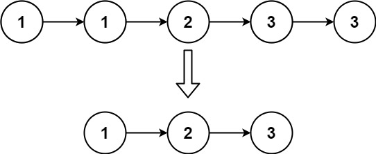

# 83. 删除排序链表中的重复元素 <Badge type="tip" text="Easy" />

给定一个已排序的链表的头 `head`， 删除所有重复的元素，使每个元素只出现一次 。返回 已排序的链表 。

>示例 1:  
输入：head = [1,1,2]
输出：[1,2]


>示例 2:  
输入：head = [1,1,2,3,3]
输出：[1,2,3]



## 解题思路
**输入：** 一个链表 `head`

**输出：** 删除链表中的重复元素重复的元素只保留一个

本题属于**链表删除类**问题。

由于重复元素还会保留一个，所以我们可以直接从 `head` 开始遍历

判断下一个节点和当前节点值是否相同，相同则跳过下一个节点，否则就移动到下一个节点

## 代码实现

::: code-group

```python
class Solution:
    def deleteDuplicates(self, head: Optional[ListNode]) -> Optional[ListNode]:
        curr = head  # 当前遍历的节点

        # 只要当前节点和下一个节点都存在，就继续遍历
        while curr and curr.next:
            if curr.val == curr.next.val:
                # 如果当前值等于下一个值，跳过下一个节点（删除重复节点）
                curr.next = curr.next.next
            else:
                # 如果值不相等，移动到下一个节点
                curr = curr.next

        return head  # 返回原链表的头节点
```

```javascript
/**
 * @param {ListNode} head
 * @return {ListNode}
 */
var deleteDuplicates = function(head) {
    let curr = head;

    while (curr && curr.next) {
        if (curr.val === curr.next.val) {
            curr.next = curr.next.next;
        } else {
            curr = curr.next;
        }
    }
    
    return head;
};
```

:::

## 复杂度分析

时间复杂度：O(n)

空间复杂度：O(1)

## 链接

[83 国际版](https://leetcode.com/problems/remove-duplicates-from-sorted-list/)

[83 中文版](https://leetcode.cn/problems/remove-duplicates-from-sorted-list/)
