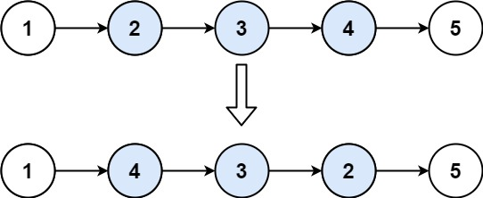

# 92. 反转链表 II <Badge type="warning" text="Medium" />

给你单链表的头指针 `head` 和两个整数 `left` 和 `right` ，其中 `left <= right` 。请你反转从位置 `left` 到位置 `right` 的链表节点，返回 反转后的链表 。



>示例 1:  
输入：head = [1,2,3,4,5], left = 2, right = 4   
输出：[1,4,3,2,5]

>示例 2:  
输入：head = [5], left = 1, right = 1   
输出：[5]

## 解题思路
**输入：** 一个链表 `head`, 两个整数 `left` `right`

**输出：** 将链表中 `[left, right]` 节点反转，返回反转后的链表

本题属于**链表反转类**问题。

我们首先要找到反转的起点前一个节点 `prev`

再将 `[left, right]` 内的节点反转，要记录反转前的最后一个节点 `reserve_pre` 以及反转前的最后一个节点的下一个节点 

反转完毕后遍历的节点 `curr` 应该 `right + 1` 处，`prev` 下一个节点成了反转后的最后一个节点，要指向反转前的最后一个节点的下一个节点 `prev.next.next = curr`

最后再将 `prev` 指向反转前的最后一个节点

## 代码实现

::: code-group

```python
class Solution:
    def reverseBetween(self, head: Optional[ListNode], left: int, right: int) -> Optional[ListNode]:
        # 创建哑节点 dummy，统一处理头节点反转的情况
        dummy = ListNode(0)
        dummy.next = head

        # 第一步：找到 left 前一个节点（即反转段的前驱）
        prev = dummy
        for _ in range(left - 1):
            prev = prev.next  # 移动到 left 的前一个节点

        # 第二步：开始反转 left 到 right 之间的链表节点
        reverse_prev = None
        curr = prev.next  # 从第 left 个节点开始反转

        for _ in range(right - left + 1):
            next_temp = curr.next
            curr.next = reverse_prev
            reverse_prev = curr
            curr = next_temp

        # 第三步：重新接回链表
        # prev.next 是原 left 节点，现在是反转段的尾部，它应该连接到反转后面那段（curr）
        prev.next.next = curr
        # prev.next 改为新的反转头（即 reverse_prev）
        prev.next = reverse_prev

        return dummy.next  # 返回真正的头节点
```

```javascript
var reverseBetween = function(head, left, right) {
    const dummy = new ListNode(0, head);
    let p0 = dummy;

    for (let i = 0; i < left - 1; i++) {
        p0 = p0.next;
    }

    let prev = null;
    let curr = p0.next;

    for (let j = left; j < right + 1; j++) {
        const nxt = curr.next;
        curr.next = prev;
        prev = curr;
        curr = nxt;
    }

    p0.next.next = curr;
    p0.next = prev;

    return dummy.next;
};
```

:::

## 复杂度分析

时间复杂度：O(n)

空间复杂度：O(1)

## 链接

[92 国际版](https://leetcode.com/problems/reverse-linked-list-ii/)

[92 中文版](https://leetcode.cn/problems/reverse-linked-list-ii/)
