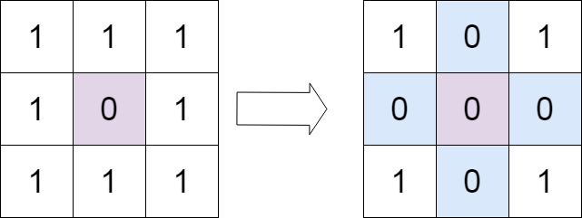
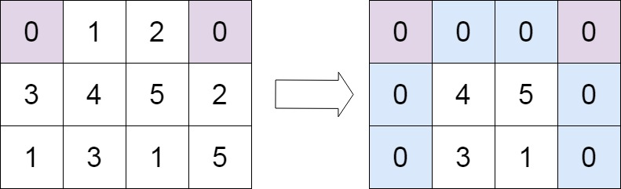

# 73. 矩阵置零 <Badge type="warning" text="Medium" />

给定一个 m x n 的矩阵，如果一个元素为 0 ，则将其所在行和列的所有元素都设为 0 。请使用 原地 算法。



>示例 1:  
输入：matrix = [[1,1,1],[1,0,1],[1,1,1]]   
输出：[[1,0,1],[0,0,0],[1,0,1]]



>示例 2:  
输入：matrix = [[0,1,2,0],[3,4,5,2],[1,3,1,5]]   
输出：[[0,0,0,0],[0,4,5,0],[0,3,1,0]]

## 解题思路
**输入：** 一个 m x n 的矩阵

**输出：** 将元素为 0 的元素所在行所在列都设为 0

本题属于**原地修改矩阵**问题。

1. 先单独判断首行、首列是否需要清零
  - 因为首行/首列要被用作标记区，不能让原始信息丢失。

2. 扫描矩阵（跳过首行首列）
  - 如果 matrix[i][j] == 0：
    - 在 matrix[i][0] 标记该行需要清零
    - 在 matrix[0][j] 标记该列需要清零

3. 再次遍历矩阵（跳过首行首列）
  - 如果该行或该列被标记为 0，就把 matrix[i][j] 置为 0。

4. 最后处理首行、首列
  - 根据第一步记录的布尔值，把首行/首列整行或整列清零。

**一句话总结：**   
用首行和首列作为“标记数组”，避免额外空间，把清零操作推迟到最后统一处理。

## 代码实现

::: code-group

```python
class Solution:
    def setZeroes(self, matrix: List[List[int]]) -> None:
        """
        Do not return anything, modify matrix in-place instead.
        """
        m, n = len(matrix), len(matrix[0])

        # 判断首行是否需要清零
        rowZero = any(matrix[0][i] == 0 for i in range(n))
        # 判断首列是否需要清零
        colZero = any(matrix[j][0] == 0 for j in range(m))

        # 遍历除首行首列以外的元素
        # 如果某个元素为 0，就把该行的第一个元素和该列的第一个元素设为 0
        # 相当于用首行和首列作为标记区
        for i in range(1, m):
            for j in range(1, n):
                if matrix[i][j] == 0:
                    matrix[i][0] = 0
                    matrix[0][j] = 0
        
        # 再次遍历矩阵（不包括首行首列）
        # 如果该行或该列在标记区为 0，就把当前元素置为 0
        for i in range(1, m):
            for j in range(1, n):
                if matrix[i][0] == 0 or matrix[0][j] == 0:
                    matrix[i][j] = 0
        
        # 如果首行一开始需要清零，则整行置 0
        if rowZero:
            for i in range(n):
                matrix[0][i] = 0
        
        # 如果首列一开始需要清零，则整列置 0
        if colZero:
            for j in range(m):
                matrix[j][0] = 0
```

```javascript
var setZeroes = function(matrix) {
    const m = matrix.length;       // 矩阵的行数
    const n = matrix[0].length;    // 矩阵的列数

    // 判断首行是否有 0
    const row0Zero = matrix[0].some(item => item === 0);
    // 判断首列是否有 0
    const col0Zero = matrix.some(item => item[0] === 0);

    // 1. 遍历除首行首列外的区域
    //    如果 matrix[i][j] == 0，就在该行的首元素和该列的首元素上做标记
    for (let i = 1; i < m; i++) {
        for (let j = 1; j < n; j++) {
            if (matrix[i][j] === 0) {
                matrix[i][0] = 0;   // 标记第 i 行需要清零
                matrix[0][j] = 0;   // 标记第 j 列需要清零
            }
        }
    }

    // 2. 再次遍历除首行首列外的区域
    //    根据标记区（首行、首列）决定是否清零
    for (let i = 1; i < m; i++) {
        for (let j = 1; j < n; j++) {
            if (matrix[i][0] === 0 || matrix[0][j] === 0) {
               matrix[i][j] = 0;   // 如果该行或该列被标记为 0，则该元素清零
            }
        }
    }

    // 3. 如果首行一开始就需要清零，则整行置 0
    if (row0Zero) {
        for (let i = 0; i < n; i++) {
            matrix[0][i] = 0;
        }
    }

    // 4. 如果首列一开始就需要清零，则整列置 0
    if (col0Zero) {
        for (let i = 0; i < m; i++) {
            matrix[i][0] = 0;
        }
    }
};
```

:::

## 复杂度分析

时间复杂度：O(n)

空间复杂度：O(1)

## 链接

[322 国际版](https://leetcode.com/problems/coin-change/)

[322 中文版](https://leetcode.cn/problems/coin-change/)
