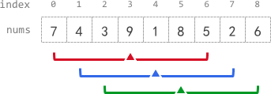

# 2090. 半径为 k 的子数组平均值 <Badge type="warning" text="Medium" />

给你一个下标从 0 开始的数组 `nums` ，数组中有 `n` 个整数，另给你一个整数 `k` 。

半径为 k 的子数组平均值 是指：`nums` 中一个以下标 i 为 中心 且 半径 为 k 的子数组中所有元素的平均值，即下标在 `i - k` 和 `i + k` 范围（含 `i - k` 和 `i + k`）内所有元素的平均值。如果在下标 `i` 前或后不足 `k` 个元素，那么 半径为 `k` 的子数组平均值 是 `-1` 。

构建并返回一个长度为 `n` 的数组 `avgs` ，其中 `avgs[i]` 是以下标 `i` 为中心的子数组的 半径为 `k` 的子数组平均值 。

x 个元素的 平均值 是 `x` 个元素相加之和除以 `x` ，此时使用截断式 整数除法 ，即需要去掉结果的小数部分。

例如，四个元素 2、3、1 和 5 的平均值是 `(2 + 3 + 1 + 5) / 4 = 11 / 4 = 2.75`，截断后得到 2 。



>示例 1：  
输入：nums = [7,4,3,9,1,8,5,2,6], k = 3 
输出：[-1,-1,-1,5,4,4,-1,-1,-1]   
解释：   
avg[0]、avg[1] 和 avg[2] 是 -1 ，因为在这几个下标前的元素数量都不足 k 个。   
中心为下标 3 且半径为 3 的子数组的元素总和是：7 + 4 + 3 + 9 + 1 + 8 + 5 = 37 。使用截断式 整数除法，avg[3] = 37 / 7 = 5 。   
中心为下标 4 的子数组，avg[4] = (4 + 3 + 9 + 1 + 8 + 5 + 2) / 7 = 4 。   
中心为下标 5 的子数组，avg[5] = (3 + 9 + 1 + 8 + 5 + 2 + 6) / 7 = 4 。   
avg[6]、avg[7] 和 avg[8] 是 -1 ，因为在这几个下标后的元素数量都不足 k 个  。 

>示例 2：  
输入：nums = [100000], k = 0   
输出：[100000]   
解释：   
中心为下标 0 且半径 0 的子数组的元素总和是：100000 。avg[0] = 100000 / 1 = 100000 。    

>示例 3：  
输入：nums = [8], k = 100000   
输出：[-1]   
解释：   
avg[0] 是 -1 ，因为在下标 0 前后的元素数量均不足 k 。   

## 解题思路

输入：一个整数数组 `nums` 和一个整数 `k`

输出：返回以下标 `i` 为 中心 且 半径 为 `k` 的子数组中所有元素的平均值

本题属于 **固定长度滑动窗口类型** 类型。

- 窗口的长度为 `2 * k + 1`
- 当窗口长度为 0 时直接返回原数组
- 当窗口长度大于数组长度时，返回 `[-1] * len(nums)`
- 我们只需要在 `[k, n - k]` 中计算平均值即可

## 代码实现

::: code-group

```python
from typing import List

class Solution:
    def getAverages(self, nums: List[int], k: int) -> List[int]:
        # 初始化结果数组，全部填充 -1
        n = len(nums)
        result = [-1] * n
        
        # 如果 k=0，每个位置的平均值就是自身
        if k == 0:
            return nums
        
        # 子数组长度为 2k+1
        window_size = 2 * k + 1
        
        # 如果窗口大小大于数组长度，所有位置都返回 -1
        if window_size > n:
            return result
        
        # 计算第一个窗口的和（索引 k 对应的子数组 nums[0:2k+1]）
        window_sum = sum(nums[:window_size])
        
        # 计算第一个有效位置（索引 k）的平均值
        result[k] = window_sum // window_size
        
        # 滑动窗口，计算后续位置的平均值
        for i in range(k + 1, n - k):
            # 减去窗口左侧元素，加入右侧新元素
            window_sum = window_sum - nums[i - k - 1] + nums[i + k]
            result[i] = window_sum // window_size
        
        return result
```

```javascript
/**
 * @param {number[]} nums
 * @param {number} k
 * @return {number[]}
 */
var getAverages = function(nums, k) {
    if (k == 0) return nums;

    const windowSize = 2 * k + 1;
    const ans = new Array(nums.length).fill(-1);
    if (windowSize > nums.length) {
        return ans;
    }

    let windowSum = 0;

    for (let i = 0; i < windowSize; i++) {
        windowSum += nums[i];
    }
    ans[k] = Math.floor(windowSum / windowSize);

    for (let i = k + 1; i < nums.length - k; i++) {
        windowSum = windowSum - nums[i - k - 1] + nums[i + k];
        ans[i] = Math.floor(windowSum / windowSize);
    }

    return ans;
};
```

:::

## 复杂度分析

时间复杂度：O(n)

空间复杂度：O(n)

## 链接

[2090 国际版](https://leetcode.com/problems/k-radius-subarray-averages/description/)

[2090 中文版](https://leetcode.cn/problems/k-radius-subarray-averages/description/)
